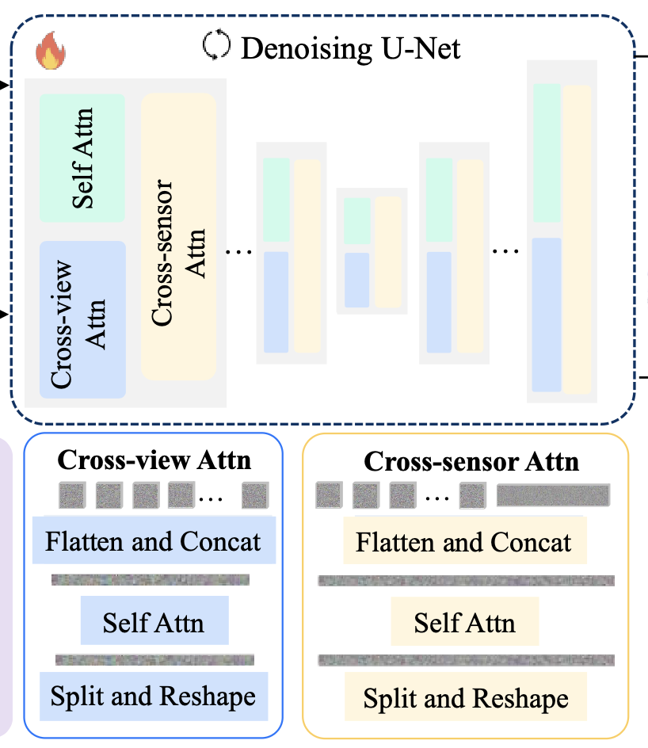
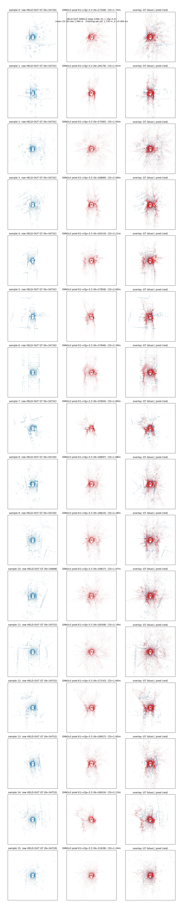

# Sensor2Sensor — Camera → LiDAR synthesis on nuScenes

A minimal, single-GPU reproduction of **cross-modal sensor synthesis**: given surround
camera images, generate the corresponding LiDAR point cloud. The pipeline is a
**DINOv3-conditioned latent diffusion** model operating over a compact **LiDAR
range-image VAE**, trained and evaluated end-to-end on a single RTX 3060 (11.6 GB).

Motivated by *X-Drive: Cross-modality Consistent Multi-Sensor Data Synthesis for
Driving Scenarios* — see [`X-Drive_...pdf`](X-Drive_Cross-modality_Consistent_Multi-Sensor_Data_Synthesis_for_Driving_Scenarios.pdf)
and [`Sensor2Sensor.pdf`](Sensor2Sensor.pdf).

> **Scope:** architecture validation on a small compute budget, **not** paper-level quality.
> The value here is a known-good, fully-reproducible base with an honest, documented
> error budget. See [`s2s_min/RESULTS.md`](s2s_min/RESULTS.md) for the complete experiment log.

---

## Pipeline

```
camera image ──▶ DINOv3 features ──▶ raymap conditioning
                                          │
                                          ▼
                        latent diffusion U-Net (v-prediction, DDIM-25)
                                          │
                                          ▼
                        LiDAR range-image VAE decode ──▶ point cloud
```



---

## Results

All metrics are **Chamfer distance in metres (lower = better)**, `cfg=3.5`, DDIM-25 steps.
Held-out tokens are drawn from 30,126 candidates that are **not** in the training cache.

### LiDAR VAE (v5 — 16 epochs, 100 scenes, LPIPS terms)

| Metric | Value |
|---|---|
| `CD-VAE-only` (decode(μ) vs raw nuScenes LiDAR) | **0.791 m** |

The VAE reconstruction bottleneck is essentially solved (down from 5.583 m in the first
milestone after a beam-ordering bug fix + retrain).

### Diffusion U-Net — data-scale comparison (N = 16 held-out samples)

| Checkpoint | train `mse_ema` | `CD-3D-raw` ↓ | `CD-BEV` ↓ |
|---|---|---|---|
| **850-scenes DINOv3** (best) | 0.314 | **1.994 m** | **1.220 m** |
| 100-scenes DINOv3 | 0.267 | 2.241 m | 1.469 m |

The **850-scenes model generalizes ~2× better on the held-out gap** (Δ +0.264 m vs
+0.511 m over the same 1.730 m training-set reference) **despite a *higher* training
MSE** — training MSE is a poor stopping signal, so evaluation is done in-loop against
held-out Chamfer distance instead (see [`RESULTS.md`](s2s_min/RESULTS.md) §15).

<details>
<summary>Full 16-sample held-out BEV comparison sheets (GT blue · prediction red)</summary>

- 850-scenes model (mean 1.994 m): [`bev_heldout_cfg3.5.png`](s2s_min/out/dinov3_heldout_demo_850scenes_ckpt_n16/bev_heldout_cfg3.5.png)
- 100-scenes model (mean 2.241 m): [`bev_heldout_cfg3.5.png`](s2s_min/out/dinov3_heldout_demo_100scenes_ckpt_n16/bev_heldout_cfg3.5.png)
- Paired image → LiDAR panels: [850-scenes](s2s_min/out/dinov3_heldout_demo_850scenes_ckpt_n16/image_heldout_cfg3.5.png) · [100-scenes](s2s_min/out/dinov3_heldout_demo_100scenes_ckpt_n16/image_heldout_cfg3.5.png)



</details>

### End-to-end (v5 VAE + diffusion, 4 held-out keyframes)

| Metric | Value |
|---|---|
| `CD-3D-raw` (camera → LiDAR, end-to-end) | **3.036 m** |

---

## Pretrained checkpoints

Weights are hosted on the Hugging Face Hub:
**[huggingface.co/sangramrout/sensor2sensor](https://huggingface.co/sangramrout/sensor2sensor)**

| File | Model | Size |
|---|---|---|
| `lidar_vae_best.pt` | v5 LiDAR range-image VAE (encoder μ + decoder) | 8.3 MB |
| `lidar_unet_best.pt` | 850-scenes DINOv3-conditioned diffusion U-Net (best held-out CD) | 59 MB |
| `lidar_unet_ema.pt`  | EMA weights of the above | 59 MB |

The 8.3 MB VAE checkpoint is also tracked directly in this repo at
[`s2s_min/out/lidar_vae_best.pt`](s2s_min/out/lidar_vae_best.pt). The larger diffusion
weights and per-run training curves live on Hugging Face (they are `.gitignore`-d here).

---

## Repository layout

| Path | Contents |
|---|---|
| [`s2s_min/`](s2s_min/) | The minimum end-to-end pipeline: `models/`, `train/`, `eval/`, `scripts/`, `configs/` |
| [`s2s_min/RESULTS.md`](s2s_min/RESULTS.md) | Full milestone-by-milestone experiment log |
| [`architecture.md`](architecture.md), [`equations.md`](equations.md), [`dataset.md`](dataset.md) | Design / math / data notes |
| [`min_pipeline_plan.md`](min_pipeline_plan.md) | The M-1 → M5 pipeline plan |
| [`paper_figures/`](paper_figures/) | Figures |
| [`Reference_code/`](Reference_code/) | Reference implementations (X-Drive submodule, etc.) |

---

## Dataset

nuScenes (v1.0-trainval, 850 scenes) is the working dataset. Candidate autonomous-driving
datasets considered:

| Dataset | Cameras | LiDAR | Scenes | Duration | Notes |
|---|---|---|---|---|---|
| Waymo Open (WOD) | 5 cam (~252°, not full 360°) | 1× top + 4× short-range | ~2,030 seg × 20 s | ~11 h | Same sensor family as the paper |
| **nuScenes** | 6 cam (full 360°) | 1× 32-beam top | 1,000 × 20 s | ~5.5 h | Full surround; the dataset used here |
| KITTI | 2 stereo + 2 grayscale (fwd) | 1× 64-beam Velodyne | ~22 seq | ~1 h | Old (2012), no surround |
| Argoverse 2 | 7 ring + 2 stereo (360°) | 2× 32-beam | 1,000 × 15 s | ~4 h | Strong nuScenes alternative |
| ZOD | 1 fwd + multi-LiDAR | ✓ | 100K+ frames | Large | Forward-only camera |
| PandaSet | 6 cam (360°) | 1× 64-beam + 1× fwd | — | — | 360° surround |

See [`dataset.md`](dataset.md) for the full discussion.

---

## Hardware & reproduction

Every milestone runs on a single **RTX 3060 (11.6 GB)**. Start from
[`min_pipeline_plan.md`](min_pipeline_plan.md) and [`s2s_min/RESULTS.md`](s2s_min/RESULTS.md);
regenerate the results table with `s2s_min/scripts/collect_results.py`.
