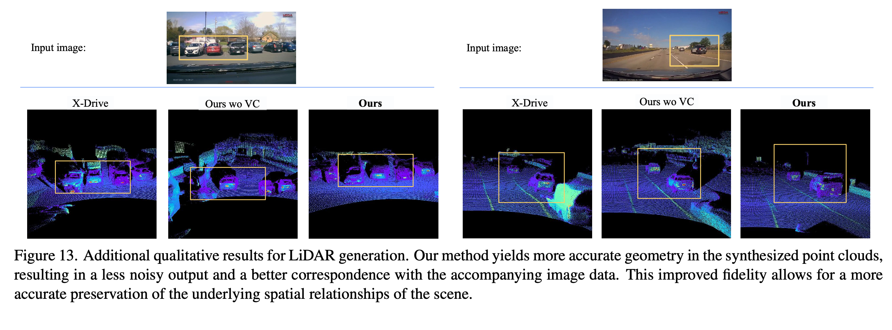
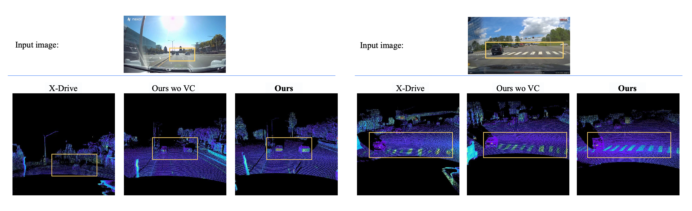
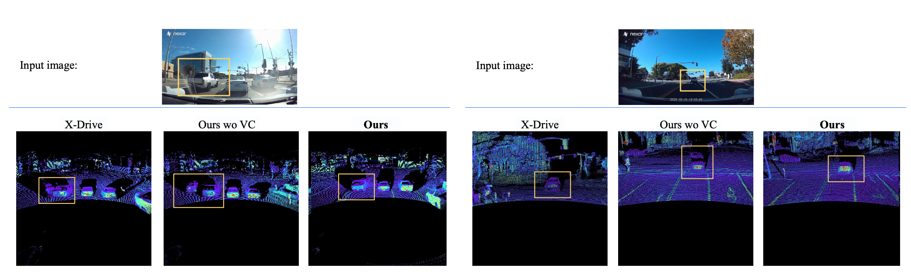
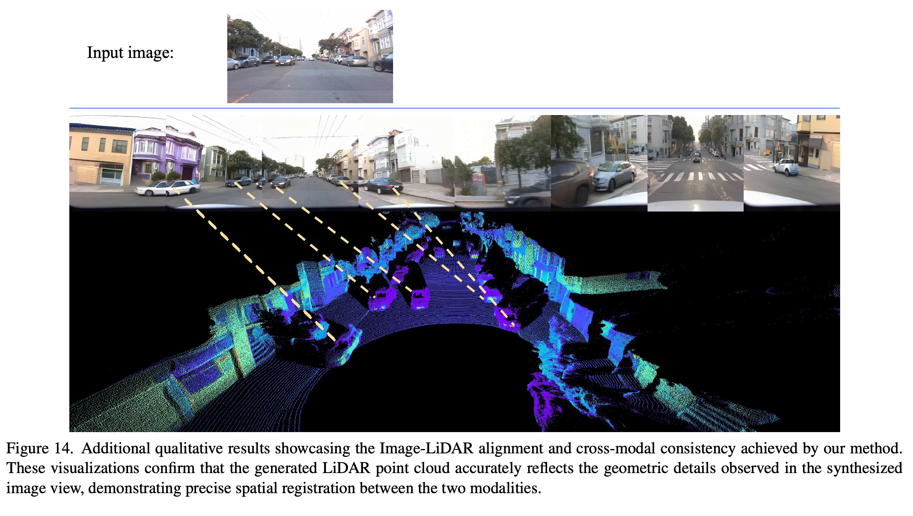
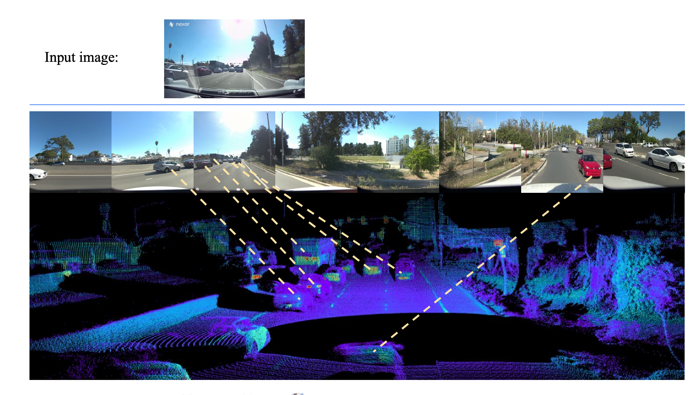

## Goal: Generate a LiDAR point cloud from dashcam images

Take ordinary monocular dashcam imagery (no calibration metadata, no depth sensor) and synthesize a plausible AV-grade LiDAR point cloud aligned to the same scene. Effectively a learned "virtual LiDAR" driven by a single forward-facing RGB stream.

### Why this is hard
- Dashcam inputs have unknown / uncalibrated intrinsics (focal length, distortion, principal point).
- Unknown extrinsics relative to the vehicle frame (mount height, pitch, forward offset).
- Variable lighting, weather, exposure, sensor noise.
- LiDAR has structured returns (range, intensity, elongation, validity) that must remain physically consistent with the visible scene geometry.
- No paired (dashcam ↔ LiDAR) data exists in the wild — must be generated via simulation.

### Input sources
Different input regimes that the model must generalize to:
- **Internet footage** — uncurated driving videos with arbitrary cameras.
- **Dashcam** — consumer-grade dashcams (Nexar, VIOFO, smartphone, ADAS).
- **Fixed camera** — bumper- or windshield-mounted single camera with known mount but unknown calibration drift.

### Output
- A range-view LiDAR spin image of shape `[H_L, W_L, D_L]` with `D_L = 4` channels (range, intensity, elongation, validity), convertible to a 3D point cloud `(x, y, z)` via vehicle trajectory + sensor calibration.
- Optionally, the surrounding multi-view camera images (8-view) that complete the scene from a single front-facing input.

---

## Architecture

Follow the design from [Sensor2Sensor.pdf](Sensor2Sensor.pdf). See [architecture.md](architecture.md) for the detailed network spec.

Reference figures (same configuration as the paper):

Key architectural ideas inherited from the paper:
- Joint diffusion over multi-view images + LiDAR range-view.
- View-concatenation (VC) instead of channel-concatenation to share information across the 8 surround views and the LiDAR view.
- Conditioning on the dashcam input via cross-attention.
- Two-stage training: (1) train on synthetic (4DGS-rendered dashcam → real AV-log LiDAR/cameras) pairs; (2) evaluate on real in-the-wild footage.

---

## Training data pipeline
See [dataset.md](dataset.md). Summary:
- ~100K Waymo AV log clips, each ~10s, with 8 surround cameras + top LiDAR.
- Each clip reconstructed via 4D Gaussian Splatting (rigid + deformable), then re-rendered with ray-traced virtual dashcam-style cameras to produce paired `(synthetic dashcam input, real AV-log ground truth)` tuples.
- Sampled dashcam extrinsics (vehicle category → pose distribution) and intrinsics (focal/distortion bank).

## Evaluation
- **Paired (quantitative):** 1,000 × 3s fixed-bumper-camera sequences vs. 8-view + LiDAR ground truth. Metrics: FID, PSNR, SSIM, LPIPS, FVD, Chamfer Distance.
- **In-the-wild (qualitative + human eval):** uncurated phone/dashcam/ADAS footage, 26-participant ranking study.
- **Downstream sim-to-real:** verify vehicle detection (LiDAR) and Panoptic-DeepLab segmentation (image) trained on real data transfer to generated data without finetuning.

## Baselines
- Reconstruction: VGGT, π³.
- Generative: X-Drive ([X-Drive_Cross-modality_Consistent_Multi-Sensor_Data_Synthesis_for_Driving_Scenarios.pdf](X-Drive_Cross-modality_Consistent_Multi-Sensor_Data_Synthesis_for_Driving_Scenarios.pdf)), CAT3D adapted with shared VAE + CC ablation ("Ours w/o VC").
