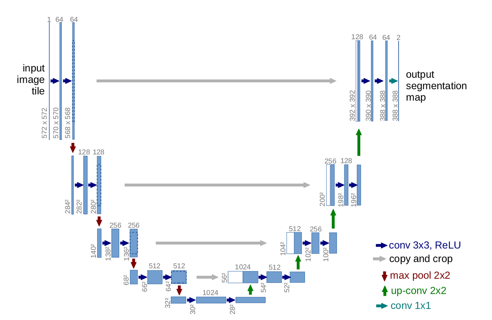
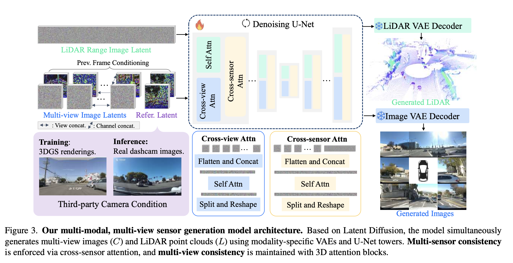

# Paper References

## LiDAR Diffusion. 

We first project the raw LiDAR range
images into a latent space using the LiDAR VAE. A Li-
DAR U-Net branch then performs diffusion on this latent, operating similarly to a standard single-view image diffu-
sion model. Each layer in the LiDAR U-Net is designed to output a feature with the same channel dimension as its corresponding layer in the multi-view image branch, enabling
our cross-sensor feature fusion.

## 3.2.3. Cross-Sensor Attention Module

As shown in Figure 3, to simultaneously generate consistent images and LiDAR, we introduce a cross-sensor atten-
tion module within each U-Net block. We inject this module after convolutional layers to promote continuous information interchange. In detail, at a given block i, we flatten the image features f i
C and LiDAR features f iL into token sequences Ti C ∈RKC ×di and Ti
L ∈RKL ×di , where
KC = N ×hi
C ×wi
C and KL = hi
L ×wi
L. The shared U-Net architecture for both modalities ensures their feature dimension di is identical. These tokens are then concatenated into a unified sequence Ti U ∈R(KC +KL )×di , and the module computes self-attention over this sequence, allowing features from both sensors to interact directly.

## 3.2. Multi-modal Diffusion Model for Sensors

To enable sensor conversion from third-party data, we first develop a multi-sensor, multi-view generation model. This model simultaneously generates multi-view images C=
{ci}N i=1 and the LiDAR point cloud L. Each sensor modality has its own VAE and U-Net branch for diffusion. The key attributes of this model are multi-view (Section 3.2.1) and multi-sensor (Section 3.2.3) consistency.

# LiDAR U-Net — build plan and reference map

Focused doc for the conditional LiDAR denoiser written in M0 and trained in M3. Companion to:

- [`min_pipeline_plan.md`](../../min_pipeline_plan.md) — milestones, scope, pass criteria
- [`architecture.md`](../../architecture.md) — every component spec, the U-Net section
- [`models.md`](models.md) — combined U-Net + LiDAR-VAE build notes
- [`image_vae_choice.md`](image_vae_choice.md) — SD 1.5 VAE selection

This doc has the **single audited list** of what we need to build, with every gap mapped to a copy-from source in [`Reference_code/`](../../Reference_code/).

---

## 1. Final spec (one-screen recap)

```
Input:  z_lidar_noisy  [B, C=8,  H=8,  W=256]   ← noised LiDAR latent
        t              [B]                       ← diffusion timestep
        kv_context     [B, C=10, H=8,  W=64]    ← pre-pooled image+raymap

Stem        : CircularConv2d(8 → 96)                                      → [B,  96, 8, 256]

Encoder
  Level 0   : 2× (ResBlock(96, FiLM-t) + SelfAttn + CrossAttn(KV=kv))     → [B,  96, 8, 256]
              DownsampleW (stride 2 on W only)                             → [B,  96, 8, 128]
  Level 1   : 2× (ResBlock(96→192, FiLM-t) + SelfAttn + CrossAttn)         → [B, 192, 8, 128]
              DownsampleW                                                  → [B, 192, 8,  64]

Bottleneck  : 2× (ResBlock(192→384, FiLM-t) + SelfAttn + CrossAttn)        → [B, 384, 8,  64]

Decoder (mirror of encoder, with skip-concat from corresponding encoder level)
  Level 1   : UpsampleW                                                    → [B, 384, 8, 128]
              cat(skip_lvl1)                                               → [B, 576, 8, 128]
              2× (ResBlock(576→192, FiLM-t) + SelfAttn + CrossAttn)        → [B, 192, 8, 128]
  Level 0   : UpsampleW                                                    → [B, 192, 8, 256]
              cat(skip_lvl0)                                               → [B, 288, 8, 256]
              2× (ResBlock(288→96, FiLM-t) + SelfAttn + CrossAttn)         → [B,  96, 8, 256]

Head        : GroupNorm → SiLU → CircularConv2d(96 → 8)   ← zero-init      → [B,   8, 8, 256]

Output:  ε̂ or v̂  [B, 8, 8, 256]
```

| Property | Value |
|---|---|
| Trainable params (target) | ~25–35 M |
| Periodic padding | Circular on W, zero on H — every conv touching W |
| Downsampling | **W-only**, stride-2 learned conv (not avg-pool) |
| Time injection | **FiLM-style additive**, per ResBlock (see §3.2) |
| Cross-attn KV | Pre-pooled `[10, 8, 64]`, projected once outside the U-Net, reused at every block |
| Prediction type | `v_prediction` |
| Optional knob | `downsample_h_once: bool` — collapses H=8→4 at stem (default off) |





### 1.1 U-shape data flow

```
                       INPUT  z_noisy  [B, 8, 8, 256]
                                   │
                                   ▼
                    ┌─────────────────────────────┐
                    │  Stem: CircConv(8 → 96)     │
                    └─────────────┬───────────────┘
                                  │  [B,  96, 8, 256]
                                  ▼
                    ╔═════════════════════════════╗      ┌──────────────────────────────────────────┐
                    ║  Enc Level 0   (ch = 96)    ║──────┤ skip_0                                   │
                    ║  2 × [ResBlock+SA+CA]       ║      │ [B, 96, 8, 256]                          │
                    ╚═════════════╤═══════════════╝      │                                          │
                                  │  [B,  96, 8, 256]    │                                          │
                                  ▼                       │                                          │
                          ┌───────────────┐               │                                          │
                          │ DownsampleW   │               │                                          │
                          └───────┬───────┘               │                                          │
                                  │  [B,  96, 8, 128]    │                                          │
                                  ▼                       │                                          │
                    ╔═════════════════════════════╗      │   ┌─────────────────────────────────┐    │
                    ║  Enc Level 1   (ch = 192)   ║──────│───┤ skip_1                          │    │
                    ║  2 × [ResBlock+SA+CA]       ║      │   │ [B, 192, 8, 128]                │    │
                    ╚═════════════╤═══════════════╝      │   │                                 │    │
                                  │  [B, 192, 8, 128]    │   │                                 │    │
                                  ▼                       │   │                                 │    │
                          ┌───────────────┐               │   │                                 │    │
                          │ DownsampleW   │               │   │                                 │    │
                          └───────┬───────┘               │   │                                 │    │
                                  │  [B, 192, 8,  64]    │   │                                 │    │
                                  ▼                       │   │                                 │    │
                    ╔═════════════════════════════╗      │   │                                 │    │
                    ║  Bottleneck    (ch = 384)   ║      │   │                                 │    │
                    ║  2 × [ResBlock+SA+CA]       ║      │   │                                 │    │
                    ╚═════════════╤═══════════════╝      │   │                                 │    │
                                  │  [B, 384, 8,  64]    │   │                                 │    │
                                  ▼                       │   │                                 │    │
                          ┌───────────────┐               │   │                                 │    │
                          │ UpsampleW     │               │   │                                 │    │
                          └───────┬───────┘               │   │                                 │    │
                                  │  [B, 384, 8, 128]    │   │                                 │    │
                                  ▼                       │   │                                 │    │
                          ┌────────────────┐              │   │                                 │    │
                          │ cat(skip_1)    │◀─────────────│───┘                                 │    │
                          └───────┬────────┘              │                                     │    │
                                  │  [B, 576, 8, 128]    │                                     │    │
                                  ▼                       │                                     │    │
                    ╔═════════════════════════════╗      │                                     │    │
                    ║  Dec Level 1   (ch → 192)   ║      │                                     │    │
                    ║  2 × [ResBlock+SA+CA]       ║      │                                     │    │
                    ╚═════════════╤═══════════════╝      │                                     │    │
                                  │  [B, 192, 8, 128]    │                                     │    │
                                  ▼                       │                                     │    │
                          ┌───────────────┐               │                                     │    │
                          │ UpsampleW     │               │                                     │    │
                          └───────┬───────┘               │                                     │    │
                                  │  [B, 192, 8, 256]    │                                     │    │
                                  ▼                       │                                     │    │
                          ┌────────────────┐              │                                     │    │
                          │ cat(skip_0)    │◀─────────────┴─────────────────────────────────────┴────┘
                          └───────┬────────┘
                                  │  [B, 288, 8, 256]
                                  ▼
                    ╔═════════════════════════════╗
                    ║  Dec Level 0   (ch → 96)    ║
                    ║  2 × [ResBlock+SA+CA]       ║
                    ╚═════════════╤═══════════════╝
                                  │  [B,  96, 8, 256]
                                  ▼
                    ┌─────────────────────────────┐
                    │  Head:                      │
                    │    GroupNorm                │
                    │    SiLU                     │
                    │    CircConv(96 → 8)         │ ← zero-init weight + bias
                    └─────────────┬───────────────┘
                                  │
                                  ▼
                       OUTPUT  ε̂ or v̂  [B, 8, 8, 256]
```

### 1.2 What's inside one level (the `2 × [ResBlock+SA+CA]` box)

Each `Enc Level k`, `Bottleneck`, or `Dec Level k` is exactly this pattern, repeated 2 times. All three inputs (`x`, `t_emb`, `kv_pre`) thread through.

```
                  x  [B, C, H, W]
                       │
                       │              t_emb [B, 384]     kv_pre [B, 512, 384]
                       │                   │                   │
                       ▼                   │                   │
            ┌────────────────────┐         │                   │
            │  ResBlock (FiLM)   │◀────────┤                   │
            │                    │         │                   │
            │   GN + SiLU        │         │                   │
            │   CircConv(C→C')   │         │                   │
            │   + emb_proj(t)    │  ← FiLM: h = h + emb_proj(t_emb)[:,:,None,None]
            │   GN + SiLU        │         │                   │
            │   CircConv(C'→C')  │  zero-init                  │
            │   + skip_path(x)   │         │                   │
            └─────────┬──────────┘         │                   │
                      │  [B, C', H, W]     │                   │
                      ▼                    │                   │
            ┌────────────────────┐         │                   │
            │  SelfAttention     │         │                   │
            │   GN pre-norm      │         │                   │
            │   flatten H·W      │         │                   │
            │   MHA Q=K=V        │         │                   │
            │   reshape, residual│         │                   │
            └─────────┬──────────┘         │                   │
                      │  [B, C', H, W]     │                   │
                      ▼                    │                   │
            ┌────────────────────┐         │                   │
            │  CrossAttention    │◀────────│───────────────────┤
            │   GN pre-norm Q    │         │                   │
            │   flatten H·W      │         │                   │
            │   Q from x, K/V    │         │                   │
            │     from kv_pre    │         │                   │
            │   reshape, residual│         │                   │
            └─────────┬──────────┘         │                   │
                      │  [B, C', H, W]     │                   │
                      ▼                    │                   │
                 ─── second iteration of the same triple ───
                      │
                      ▼
                  out [B, C', H, W]
```

`C → C'` is the channel-change point (only on the first ResBlock per level if the level changes channels). Subsequent ResBlocks at the same level keep `C' → C'`.

### 1.3 Conditioning paths (fed once, distributed everywhere)

```
   ─────────────── TIMESTEP PATH ───────────────────────────────────────────────────

   t [B]                                                                t_emb [B, 384]
     │                                                                       │
     ▼                                                                       │
   sinusoidal_embedding(96)         (canonical OpenAI ADM 8-line fn)         │
     │                                                                       │
     ▼                                                                       │
   TimestepMLP                                                               │
     Linear(96 → 384)                                                        │
     SiLU                                                                    │
     Linear(384 → 384)              shape: [B, 384]                          │
                                                                              │
                          ── shared across every ResBlock in the U-Net ─────▶ all ResBlocks
                              (each ResBlock has its own per-channel
                              emb_proj: Linear(384 → C_out))


   ──────────── CROSS-ATTENTION KV PATH (pre-projected once) ─────────────────────

   kv_context [B, 10, 8, 64]                                          kv_pre [B, 512, 384]
        │                                                                    │
        │  flatten H·W → [B, 8·64, 10] = [B, 512, 10]                        │
        ▼                                                                    │
   LayerNorm(10)                                                             │
        │                                                                    │
        ▼                                                                    │
   shared K-projection: Linear(10 → 384)         (K once)                    │
   shared V-projection: Linear(10 → 384)         (V once)                    │
        │                                                                    │
        ▼                                                                    │
   {K_pre, V_pre} ∈ [B, 512, 384] each                                       │
                                                                              │
                          ── shared across every CrossAttn in the U-Net ───▶ all CrossAttn blocks
                              (each block still has its own Q-projection
                              that takes its level's channel count)
```

### 1.4 Param-count back-of-envelope

| Block | Param contribution (rough) |
|---|---|
| Stem (`CircConv 8→96`) | 7 K |
| Enc Lvl 0: 2 × ResBlock(96→96)+SA(96)+CA(96←384) | ~1.8 M |
| DownW (96) | ~83 K |
| Enc Lvl 1: 2 × ResBlock(96→192, then 192→192)+SA(192)+CA(192←384) | ~6.7 M |
| DownW (192) | ~330 K |
| Bottleneck: 2 × ResBlock(192→384, then 384→384)+SA(384)+CA(384←384) | ~16.8 M |
| UpW(384) | ~1.3 M |
| Dec Lvl 1: 2 × ResBlock(576→192, then 192→192)+SA(192)+CA(192←384) | ~3.6 M |
| UpW(192) | ~330 K |
| Dec Lvl 0: 2 × ResBlock(288→96, then 96→96)+SA(96)+CA(96←384) | ~1.4 M |
| Head (`CircConv 96→8`) | 7 K |
| TimestepMLP + emb_projs distributed across ResBlocks | ~250 K |
| Shared KV K/V proj (10→384) × 2 | 8 K |
| **Approx total** | **~32 M params** |

Lands in the 25–35 M target. The bottleneck dominates (~50% of params), which is expected for U-Nets at this depth.

---

## 2. The decision log

### 2.1 FiLM over AdaLN-Zero (committed)

| | FiLM (chosen) | AdaLN-Zero (rejected) |
|---|---|---|
| Style | `h = h + emb_proj(t_emb)[:, :, None, None]` after conv1 in each ResBlock | `h = norm(h) * (1 + scale) + shift` with zero-init scale/shift proj |
| Local reference | ✅ MVDream `ResBlock.forward()` — verbatim portable | ❌ none in `Reference_code/`; would need to write from diffusers source or memory |
| Production track record | SD 1/2, OpenAI ADM, RangeLDM, X-Drive | DiT (Peebles 2023), SD 3+ |
| Risk of subtle bug | Low (copy from MVDream) | Moderate (custom impl) |
| Performance gap | None observed in literature at our scale | — |

**Decision:** FiLM. Reflected in [`min_pipeline_plan.md` §"U-Net details → Source & initialization"](../../min_pipeline_plan.md).

### 2.2 Learned stride-2 downsample over avg-pool (committed)

MVDream's `Downsample` defaults to a learned stride-2 conv; we keep that pattern, just constrained to W-axis (`stride=(1, 2)`). Avg-pool would save ~10 K params per block but quality regression is documented in DDPM++ ablations.

Already implemented as [`DownsampleW`](../models/blocks.py).

### 2.3 KV pre-projection outside the U-Net (committed)

`kv_context` shape and content are constant across all U-Net blocks. Pre-project K and V once, reuse inside every `CrossAttention`. Saves ~10× compute on KV projections across the 6 blocks that use them. Implementation note: requires the small refactor to `CrossAttention` flagged in [`models.md` §1.4](models.md).

### 2.4 Scope-A U-Net first, scope-B variant deferred (committed)

This doc specifies the **scope-A U-Net**: single-camera input, one-way `CrossAttention` (Q=LiDAR, KV=image+raymap), no input-side cross-view fusion. Full scope comparison and the rationale lives in [`min_pipeline_plan.md` §"Scope options → Decision"](../../min_pipeline_plan.md). Summary:

| Question | Answer |
|---|---|
| Why not start with scope B (6 cameras + paper-faithful cross-sensor self-attn)? | B exercises 2/3 paper attention blocks faithfully, A only 1/3 — but B's debug surface is roughly 2× A's. Bug-triage cost on a 3060 dominates. |
| What's the decisive argument? | **Bug-localization.** A failure in M3 has ~5 suspects under A (data norm, VAE stats, U-Net stem, noise schedule, EMA). Under B-from-scratch the suspect list expands by 5 more (6-cam batch shape, cross-view fusion, paper-faithful cross-sensor concat, KV token-count, symmetric self-attn projection). Multi-day debug vs sub-hour. |
| What's the upgrade path A → B? | ~180 LOC of localized change against a proven A baseline. Concretely: `data/nuscenes_mini_paired.py` 6-cam loader (~20), `models/image_encoder.py` batch-of-views reshape (~5), new `CrossViewFusion` block (~50), new `CrossSensorSelfAttn` block replacing `CrossAttention` in U-Net wiring (~80), config updates (1), M-1 test updates (~20). |
| When to do the upgrade? | Only after M3 passes on scope A with non-trivial M4 BEV output. The investment is 2–3 days for A vs 4–5 days + tail-risk if starting from B directly. |
| What does this mean for the U-Net we're about to write? | **No structural change to anything in §1.** The `LiDARUNet` class, channel ladder, ResBlock + FiLM, SelfAttn, CrossAttn, DownsampleW, UpsampleW — all unchanged when we eventually upgrade to B. Only the `CrossAttention` block becomes `CrossSensorSelfAttn`, and a new `CrossViewFusion` lands outside the U-Net (before `kv_context` is built). The U-Net itself is unaware of the scope distinction. |

The scope decision is therefore **insulated from this build plan** — we write the scope-A U-Net per §1, and the scope-B upgrade is a follow-on that swaps two attention blocks without touching the encoder/decoder skeleton.

### 2.5 Attention placement — current default vs VRAM-saving alternative (NOTED, not committed)

**Default (what we build first):** Self-Attn + Cross-Attn at **every** U-Net block — all three levels (Enc 0 / Enc 1 / Bottleneck) and both decoder levels. This is what §1 specifies. Most expressive option, matches the paper's spirit (the paper doesn't drop attention at high-res), comfortably fits the 3060 budget.

**Alternative (VRAM reduction):** SD-style attention-only-at-low-resolutions, matching Stable Diffusion's `attention_resolutions=[1, 2, 4]` convention. Drops the most expensive attention blocks while keeping the bottleneck's global view intact.

| Level | Spatial | Tokens | Default | SD-style reduced |
|---|---|---|---|---|
| Enc / Dec L0 | 8×256 | 2048 | SelfAttn + CrossAttn | **ResBlock only** |
| Enc / Dec L1 | 8×128 | 1024 | SelfAttn + CrossAttn | ResBlock + CrossAttn (no self-attn) |
| Bottleneck | 8×64 | 512 | SelfAttn + CrossAttn | same |

**Why this is the right VRAM knob:** Self-attn matrix size scales as `N²` where `N` is the token count. At Enc L0 (`N = 2048`), the matrix is **16× larger** than at the bottleneck (`N = 512`). So one block of `SelfAttn(96)` at 8×256 costs ~16× a block of `SelfAttn(384)` at 8×64, despite the bottleneck having 4× the channels. Dropping the 4 high-res SelfAttn blocks (2 encoder + 2 decoder at L0) is the single biggest VRAM win available in this architecture without changing the latent shape.

| Estimate | Default | SD-style reduced |
|---|---|---|
| Trainable params | ~32 M | ~28 M |
| M3 peak VRAM (estimate) | ~5–7 GB | ~3–5 GB |
| Wall-clock per training step | baseline | ~30% faster (fewer attn matmuls at the heavy resolution) |

**How to flip later:** When we write [`s2s_min/models/unet.py`](../models/unet.py), expose an `attention_resolutions` argument that takes either a list of token-count thresholds (SD convention) or per-level `use_self_attn` / `use_cross_attn` booleans. Default these to **full attention** (matching §1). If VRAM gets tight in M3, change one config line in [`configs/min.yaml`](../configs/min.yaml). No code change required.

**Trigger to flip in M3:** peak VRAM crosses ~9 GB (leaves no headroom for the desktop), OR step-time becomes a real bottleneck on long runs. **Risk if flipped:** higher chance of a visible seam artifact in M4 BEV output, because the model loses high-resolution global awareness of the azimuth-periodic W axis (only circular conv's 3-pixel receptive field handles seam continuity at the top level). If the seam shows up after flipping, flip back.

---

## 3. Per-component reference map

For each block we need to write, the **exact file:line** to copy/adapt from.

### 3.1 `timestep_embedding(t, dim)` — pure function

**Copy verbatim from:**
[`Reference_code/MVDream/mvdream/ldm/modules/diffusionmodules/util.py:165`](../../Reference_code/MVDream/mvdream/ldm/modules/diffusionmodules/util.py#L165)

This is the canonical OpenAI ADM function. Identical in CompVis SD, SDM, and ~50+ downstream papers. ~8 LOC. **Do not reinvent.**

```python
def timestep_embedding(timesteps, dim, max_period=10000):
    half = dim // 2
    freqs = torch.exp(
        -math.log(max_period) * torch.arange(0, half, dtype=torch.float32) / half
    ).to(timesteps.device)
    args = timesteps[:, None].float() * freqs[None]
    embedding = torch.cat([torch.cos(args), torch.sin(args)], dim=-1)
    if dim % 2:
        embedding = torch.cat([embedding, torch.zeros_like(embedding[:, :1])], dim=-1)
    return embedding
```

Lives in: new file [`s2s_min/models/timestep.py`](../models/timestep.py).

### 3.2 `TimestepMLP` — 2-layer MLP

**Inline pattern from:**
[`Reference_code/MVDream/mvdream/ldm/modules/diffusionmodules/openaimodel.py`](../../Reference_code/MVDream/mvdream/ldm/modules/diffusionmodules/openaimodel.py) — `UNetModel.__init__`, search for `self.time_embed`.

```python
time_embed_dim = model_channels * 4         # e.g. 96 * 4 = 384
self.time_embed = nn.Sequential(
    nn.Linear(model_channels, time_embed_dim),
    nn.SiLU(),
    nn.Linear(time_embed_dim, time_embed_dim),
)
```

Identical to `diffusers.models.embeddings.TimestepEmbedding`.

Lives in: same file [`s2s_min/models/timestep.py`](../models/timestep.py).

### 3.3 `ResBlock(in_ch, out_ch, t_emb_dim)` — with FiLM injection

**Adapt from:**
[`Reference_code/MVDream/mvdream/ldm/modules/diffusionmodules/openaimodel.py`](../../Reference_code/MVDream/mvdream/ldm/modules/diffusionmodules/openaimodel.py) — class `ResBlock(TimestepBlock)`, especially `_forward()`.

**Modifications from the reference:**
1. Replace `nn.Conv2d` with our [`CircularConv2d`](../models/blocks.py).
2. Drop the optional up/down resampling paths (we handle resampling outside the ResBlock).
3. Keep the `_forward` / `forward` split so `torch.utils.checkpoint` wraps cleanly.

Skeleton after porting (verify against the MVDream original):

```python
class ResBlock(nn.Module):
    """Pre-norm ResNet block with FiLM-style timestep injection."""
    def __init__(self, in_ch, out_ch, t_emb_dim, groups=32):
        super().__init__()
        self.norm1 = nn.GroupNorm(min(groups, in_ch), in_ch)
        self.conv1 = CircularConv2d(in_ch, out_ch, kernel_size=3)
        self.emb_proj = nn.Sequential(
            nn.SiLU(), nn.Linear(t_emb_dim, out_ch),
        )
        self.norm2 = nn.GroupNorm(min(groups, out_ch), out_ch)
        self.conv2 = CircularConv2d(out_ch, out_ch, kernel_size=3)
        nn.init.zeros_(self.conv2.conv.weight)   # zero-init final conv
        nn.init.zeros_(self.conv2.conv.bias)
        self.skip = (
            nn.Conv2d(in_ch, out_ch, 1) if in_ch != out_ch else nn.Identity()
        )

    def forward(self, x, t_emb):
        h = self.conv1(F.silu(self.norm1(x)))
        h = h + self.emb_proj(t_emb)[:, :, None, None]   # FiLM additive
        h = self.conv2(F.silu(self.norm2(h)))
        return self.skip(x) + h
```

**Lives in:** [`s2s_min/models/blocks.py`](../models/blocks.py) — upgrade the existing `ResBlock` (M-1 version is timestep-free).

### 3.4 `TimestepEmbedSequential` — the dispatch glue

**Copy verbatim from:**
[`Reference_code/MVDream/mvdream/ldm/modules/diffusionmodules/openaimodel.py:72`](../../Reference_code/MVDream/mvdream/ldm/modules/diffusionmodules/openaimodel.py#L72)

```python
class TimestepEmbedSequential(nn.Sequential):
    """Sequential that knows to pass `t_emb` to blocks that take it,
    and `kv_context` to blocks that take it."""
    def forward(self, x, t_emb, kv_context=None):
        for layer in self:
            if isinstance(layer, ResBlock):
                x = layer(x, t_emb)
            elif isinstance(layer, CrossAttention):
                x = layer(x, kv_context)
            else:
                x = layer(x)
        return x
```

(Slight extension over MVDream: our cross-attn block signature is `(x, kv)` not `(x, context)` — adjust the `isinstance` branches.)

Lives in: [`s2s_min/models/unet.py`](../models/unet.py).

### 3.5 `MultiHeadAttention`, `SelfAttention`, `CrossAttention`

**Already in [`s2s_min/models/attention.py`](../models/attention.py)** (M-1, shape-tested). Cross-reference: MVDream `AttentionBlock` and `SpatialTransformer` in the same `openaimodel.py`. The patterns match.

Open M0 work item:
- Tiny refactor in `CrossAttention.__init__` to optionally accept **pre-projected K and V** (so the U-Net can project them once at the top of `forward()` instead of per-block).

### 3.6 `CircularConv2d`, `DownsampleW`, `UpsampleW`

**Already in [`s2s_min/models/blocks.py`](../models/blocks.py)** (M-1, shape-tested).

Cross-reference: [`Reference_code/X-Drive/xdrive/networks/circular_modules.py`](../../Reference_code/X-Drive/xdrive/networks/circular_modules.py) (59 LOC). Worth comparing ours against theirs once to confirm the wrap semantics match.

### 3.7 `EncoderLevel`, `DecoderLevel`, `Bottleneck`

**Adapt from:**
[`Reference_code/MVDream/mvdream/ldm/modules/diffusionmodules/openaimodel.py`](../../Reference_code/MVDream/mvdream/ldm/modules/diffusionmodules/openaimodel.py) — `UNetModel.input_blocks`, `middle_block`, `output_blocks` construction.

Pattern: each "level" is a list of `TimestepEmbedSequential([ResBlock, SelfAttn, CrossAttn])`, optionally followed by a `DownsampleW` (encoder) or preceded by an `UpsampleW + skip-concat` (decoder).

Open work items:
- `EncoderLevel` (already in `blocks.py` from M-1) needs the `t_emb` argument plumbed through, and needs to return the pre-downsample feature for skip-concat.
- `DecoderLevel` — new. Mirror of `EncoderLevel` with upsample-first + skip-concat.
- `Bottleneck` — new. Like an `EncoderLevel` but without the downsample at the end.

Lives in: [`s2s_min/models/blocks.py`](../models/blocks.py) (upgrade EncoderLevel) and [`s2s_min/models/unet.py`](../models/unet.py) (new DecoderLevel + Bottleneck).

### 3.8 `LiDARUNet` — the assembly

**Two-tier reference strategy:**

| Aspect | Best reference | Why |
|---|---|---|
| **Overall assembly pattern** (`input_blocks` → `middle_block` → `output_blocks` with skip-list management) | [`Reference_code/MVDream/.../openaimodel.py`](../../Reference_code/MVDream/mvdream/ldm/modules/diffusionmodules/openaimodel.py) — class `UNetModel` | Cleanest pedagogical layout. Easier to read end-to-end than X-Drive. |
| **LiDAR-specific concerns** (range-image conditioning, channel-mult scheme) | [`Reference_code/X-Drive/xdrive/networks/unet_pc_condition_RangeLDM.py`](../../Reference_code/X-Drive/xdrive/networks/unet_pc_condition_RangeLDM.py) (368 LOC) | Already operates on LiDAR range images with circular conditioning. Spelled-out channel-mult scheme via `ch_mult`. |
| **Modern HF API conventions** (config dataclass, factory dispatch on block-type strings) | [`Reference_code/unet_2d_condition.py`](../../Reference_code/unet_2d_condition.py) | Reference only — adds abstractions we don't need at our scale. |

**Recommended porting order**: skeleton from MVDream, channel-mult logic from X-Drive, ignore HF abstractions. Target ~150 LOC for our smaller depth-2 model.

Lives in: [`s2s_min/models/unet.py`](../models/unet.py).

---

## 4. Step-by-step porting plan

| Step | Action | LOC delta | File |
|---|---|---|---|
| 1 | Copy `timestep_embedding` verbatim from MVDream `util.py:165` | ~10 | new `models/timestep.py` |
| 2 | Add `TimestepMLP` (3 lines, inline pattern from MVDream `UNetModel.time_embed`) | ~10 | `models/timestep.py` |
| 3 | Upgrade `ResBlock` in `blocks.py` to take `t_emb` and inject via FiLM (per §3.3 above) | +30 to existing file | `models/blocks.py` |
| 4 | Refactor `CrossAttention` to optionally accept pre-projected K, V | +20 to existing file | `models/attention.py` |
| 5 | Add `Bottleneck`, `DecoderLevel` classes; upgrade `EncoderLevel` for `t_emb` and skip return | ~80 | `models/unet.py` (Bottleneck, DecoderLevel) + `models/blocks.py` (EncoderLevel) |
| 6 | Copy `TimestepEmbedSequential` from MVDream `openaimodel.py:72`, adapt for our 3-arg block types | ~20 | `models/unet.py` |
| 7 | Assemble `LiDARUNet`: stem → 2 encoder levels → bottleneck → 2 decoder levels → head. Use MVDream's `UNetModel` as the layout template, X-Drive for LiDAR-specific channel-mult logic. | ~150 | `models/unet.py` |
| 8 | Add tests: forward shape, backward gradient flow, zero-init identity check | ~80 | new `tests/test_unet.py` |

**Total: ~400 LOC of new + ~50 LOC of edits to existing files.**

---

## 5. Verification — what M0's smoke test exercises in this U-Net

| Path | Block | Check |
|---|---|---|
| Forward | every layer | Output shape `[B, 8, 8, 256]` matches input |
| Forward | every layer | No NaN, no Inf |
| Forward | bottleneck | Self-attn works at `8×64` (~512 tokens) — VRAM modest |
| Forward | every block | Cross-attn produces well-conditioned outputs (no degenerate softmax) |
| Backward | every parameter | Non-None gradient |
| Backward | output head | Initial loss ≈ MSE(random_noise, v_target) without drift |
| Backward | time embedding | Gradient on `time_embed` proves timestep argument is used |
| Memory | overall | Peak VRAM < 6 GB (M0 budget per [`min_pipeline_plan.md`](../../min_pipeline_plan.md)) |

Tests in `tests/test_unet.py` (step 8 above) cover items 1–6 statically. M0's `smoke_test.py` covers items 5–8 on a real nuScenes sample.

---

## 6. What we are explicitly NOT doing in M0

For the record so M5 documentation is honest:

- **No AdaLN-Zero.** FiLM additive injection only. See §2.1.
- **No multi-resolution attention list.** SD U-Net has `attention_resolutions=[1, 2, 4]` controlling which levels get self-attn. Our model is so small (2 levels + bottleneck = 3 levels total) we apply self-attn + cross-attn at every block uniformly. Simpler.
- **No class conditioning** (no `num_classes` argument in MVDream's `UNetModel` is used).
- **No SpatialTransformer with separate context dim per level.** We use a single shared `kv_context` everywhere.
- **No `use_scale_shift_norm=True`** (MVDream's optional AdaGN variant). FiLM additive is what we want.
- **No `use_new_attention_order`** flag. Default suffices.
- **No `dropout`** for now. Add if M3 shows overfitting.
- **No `use_spatial_transformer=False` fallback.** Cross-attn is always on (it's the conditioning mechanism).

---

## 7. References at a glance

| File | Role | LOC |
|---|---|---|
| [`Reference_code/MVDream/mvdream/ldm/modules/diffusionmodules/util.py`](../../Reference_code/MVDream/mvdream/ldm/modules/diffusionmodules/util.py) | `timestep_embedding` | ~250 |
| [`Reference_code/MVDream/mvdream/ldm/modules/diffusionmodules/openaimodel.py`](../../Reference_code/MVDream/mvdream/ldm/modules/diffusionmodules/openaimodel.py) | `TimestepBlock`, `TimestepEmbedSequential`, `ResBlock`, `Upsample`, `Downsample`, `AttentionBlock`, `UNetModel` | ~800 |
| [`Reference_code/X-Drive/xdrive/networks/unet_pc_condition_RangeLDM.py`](../../Reference_code/X-Drive/xdrive/networks/unet_pc_condition_RangeLDM.py) | RangeLDM-style LiDAR U-Net with circular conditioning — assembly reference | 368 |
| [`Reference_code/X-Drive/xdrive/networks/circular_modules.py`](../../Reference_code/X-Drive/xdrive/networks/circular_modules.py) | Circular conv wrappers — cross-check against ours | 59 |
| [`Reference_code/X-Drive/xdrive/networks/blocks_pc_RangeLDM.py`](../../Reference_code/X-Drive/xdrive/networks/blocks_pc_RangeLDM.py) | LiDAR-specific block compositions — check against ours | 1126 |
| [`Reference_code/unet_2d_condition.py`](../../Reference_code/unet_2d_condition.py) | HF diffusers UNet2DConditionModel — modern abstractions; reference only | ~1500 |
| [`Reference_code/Pytorch-UNet/unet/unet_model.py`](../../Reference_code/Pytorch-UNet/unet/unet_model.py) | Vanilla segmentation U-Net — topology reference only, no diffusion features | ~50 |
| [`Reference_code/light-field-networks/`](../../Reference_code/light-field-networks/) | Sitzmann's LFN — raymap-conditioning ancestry, already adopted | — |

**Coverage status:** every M0 U-Net component has at least one local-code reference. Zero novel architecture work needed; the job is principled porting + LiDAR-specific adaptation (circular W + anisotropic down).

---

## 8. Estimated time

Based on the critique's estimate plus our existing M-1 building blocks:

| Phase | Hours |
|---|---|
| Steps 1–4 (timestep + FiLM ResBlock + KV-pre-proj refactor) | 1.5 |
| Steps 5–6 (level compositions + TimestepEmbedSequential glue) | 1.5 |
| Step 7 (LiDARUNet assembly) | 1.5 |
| Step 8 (tests) | 0.5–1 |
| Debug + integrate with M0 smoke test | 1–2 |
| **Total** | **6–8 hours** |

This is the **largest single piece of M0**. The other M0 files (image_encoder.py, raymap.py, diffusion.py, smoke_test.py) together are another ~3–4 hours.
