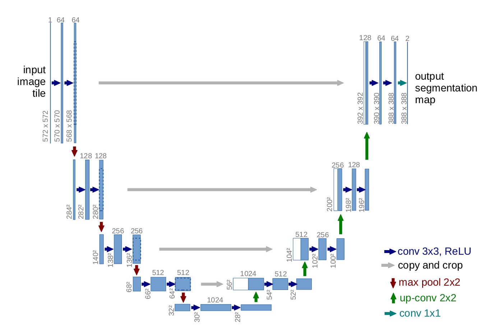
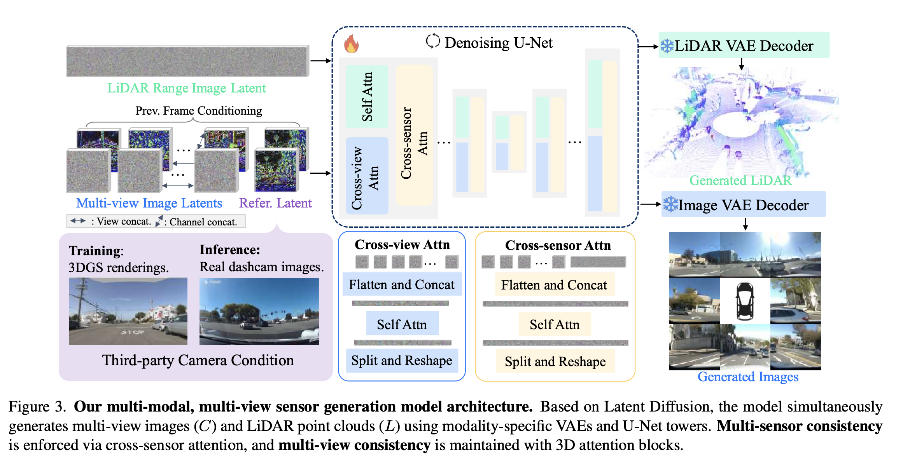

# Paper References

## LiDAR Diffusion. 

We first project the raw LiDAR range
images into a latent space using the LiDAR VAE. A Li-
DAR U-Net branch then performs diffusion on this latent, operating similarly to a standard single-view image diffu-
sion model. Each layer in the LiDAR U-Net is designed to output a feature with the same channel dimension as its corresponding layer in the multi-view image branch, enabling
our cross-sensor feature fusion.

## 3.2.3. Cross-Sensor Attention Module

As shown in Figure 3, to simultaneously generate consistent images and LiDAR, we introduce a cross-sensor atten-
tion module within each U-Net block. We inject this module after convolutional layers to promote continuous information interchange. In detail, at a given block i, we flatten the image features f i
C and LiDAR features f iL into token sequences Ti C ∈RKC ×di and Ti
L ∈RKL ×di , where
KC = N ×hi
C ×wi
C and KL = hi
L ×wi
L. The shared U-Net architecture for both modalities ensures their feature dimension di is identical. These tokens are then concatenated into a unified sequence Ti U ∈R(KC +KL )×di , and the module computes self-attention over this sequence, allowing features from both sensors to interact directly.

## 3.2. Multi-modal Diffusion Model for Sensors

To enable sensor conversion from third-party data, we first develop a multi-sensor, multi-view generation model. This model simultaneously generates multi-view images C=
{ci}N i=1 and the LiDAR point cloud L. Each sensor modality has its own VAE and U-Net branch for diffusion. The key attributes of this model are multi-view (Section 3.2.1) and multi-sensor (Section 3.2.3) consistency.

# LiDAR U-Net — build plan and reference map

Focused doc for the conditional LiDAR denoiser written in M0 and trained in M3. Companion to:

- [`min_pipeline_plan.md`](../../min_pipeline_plan.md) — milestones, scope, pass criteria
- [`architecture.md`](../../architecture.md) — every component spec, the U-Net section
- [`models.md`](models.md) — combined U-Net + LiDAR-VAE build notes
- [`image_vae_choice.md`](image_vae_choice.md) — SD 1.5 VAE selection

This doc has the **single audited list** of what we need to build, with every gap mapped to a copy-from source in [`Reference_code/`](../../Reference_code/).

---

## 1. Final spec (one-screen recap)

```
Input:  z_lidar_noisy  [B, C=8,  H=8,  W=256]   ← noised LiDAR latent
        t              [B]                       ← diffusion timestep
        kv_context     [B, C=10, H=8,  W=64]    ← pre-pooled image+raymap

Stem        : CircularConv2d(8 → 96)                                      → [B,  96, 8, 256]

Encoder
  Level 0   : 2× (ResBlock(96, FiLM-t) + SelfAttn + CrossAttn(KV=kv))     → [B,  96, 8, 256]
              DownsampleW (stride 2 on W only)                             → [B,  96, 8, 128]
  Level 1   : 2× (ResBlock(96→192, FiLM-t) + SelfAttn + CrossAttn)         → [B, 192, 8, 128]
              DownsampleW                                                  → [B, 192, 8,  64]

Bottleneck  : 2× (ResBlock(192→384, FiLM-t) + SelfAttn + CrossAttn)        → [B, 384, 8,  64]

Decoder (mirror of encoder, with skip-concat from corresponding encoder level)
  Level 1   : UpsampleW                                                    → [B, 384, 8, 128]
              cat(skip_lvl1)                                               → [B, 576, 8, 128]
              2× (ResBlock(576→192, FiLM-t) + SelfAttn + CrossAttn)        → [B, 192, 8, 128]
  Level 0   : UpsampleW                                                    → [B, 192, 8, 256]
              cat(skip_lvl0)                                               → [B, 288, 8, 256]
              2× (ResBlock(288→96, FiLM-t) + SelfAttn + CrossAttn)         → [B,  96, 8, 256]

Head        : GroupNorm → SiLU → CircularConv2d(96 → 8)   ← zero-init      → [B,   8, 8, 256]

Output:  ε̂ or v̂  [B, 8, 8, 256]
```

| Property | Value |
|---|---|
| Trainable params (target) | ~25–35 M |
| Periodic padding | Circular on W, zero on H — every conv touching W |
| Downsampling | **W-only**, stride-2 learned conv (not avg-pool) |
| Time injection | **FiLM-style additive**, per ResBlock (see §3.2) |
| Cross-attn KV | Pre-pooled `[10, 8, 64]`, projected once outside the U-Net, reused at every block |
| Prediction type | `v_prediction` |
| Optional knob | `downsample_h_once: bool` — collapses H=8→4 at stem (default off) |





### 1.1 U-shape data flow

```
                       INPUT  z_noisy  [B, 8, 8, 256]
                                   │
                                   ▼
                    ┌─────────────────────────────┐
                    │  Stem: CircConv(8 → 96)     │
                    └─────────────┬───────────────┘
                                  │  [B,  96, 8, 256]
                                  ▼
                    ╔═════════════════════════════╗      ┌──────────────────────────────────────────┐
                    ║  Enc Level 0   (ch = 96)    ║──────┤ skip_0                                   │
                    ║  2 × [ResBlock+SA+CA]       ║      │ [B, 96, 8, 256]                          │
                    ╚═════════════╤═══════════════╝      │                                          │
                                  │  [B,  96, 8, 256]    │                                          │
                                  ▼                       │                                          │
                          ┌───────────────┐               │                                          │
                          │ DownsampleW   │               │                                          │
                          └───────┬───────┘               │                                          │
                                  │  [B,  96, 8, 128]    │                                          │
                                  ▼                       │                                          │
                    ╔═════════════════════════════╗      │   ┌─────────────────────────────────┐    │
                    ║  Enc Level 1   (ch = 192)   ║──────│───┤ skip_1                          │    │
                    ║  2 × [ResBlock+SA+CA]       ║      │   │ [B, 192, 8, 128]                │    │
                    ╚═════════════╤═══════════════╝      │   │                                 │    │
                                  │  [B, 192, 8, 128]    │   │                                 │    │
                                  ▼                       │   │                                 │    │
                          ┌───────────────┐               │   │                                 │    │
                          │ DownsampleW   │               │   │                                 │    │
                          └───────┬───────┘               │   │                                 │    │
                                  │  [B, 192, 8,  64]    │   │                                 │    │
                                  ▼                       │   │                                 │    │
                    ╔═════════════════════════════╗      │   │                                 │    │
                    ║  Bottleneck    (ch = 384)   ║      │   │                                 │    │
                    ║  2 × [ResBlock+SA+CA]       ║      │   │                                 │    │
                    ╚═════════════╤═══════════════╝      │   │                                 │    │
                                  │  [B, 384, 8,  64]    │   │                                 │    │
                                  ▼                       │   │                                 │    │
                          ┌───────────────┐               │   │                                 │    │
                          │ UpsampleW     │               │   │                                 │    │
                          └───────┬───────┘               │   │                                 │    │
                                  │  [B, 384, 8, 128]    │   │                                 │    │
                                  ▼                       │   │                                 │    │
                          ┌────────────────┐              │   │                                 │    │
                          │ cat(skip_1)    │◀─────────────│───┘                                 │    │
                          └───────┬────────┘              │                                     │    │
                                  │  [B, 576, 8, 128]    │                                     │    │
                                  ▼                       │                                     │    │
                    ╔═════════════════════════════╗      │                                     │    │
                    ║  Dec Level 1   (ch → 192)   ║      │                                     │    │
                    ║  2 × [ResBlock+SA+CA]       ║      │                                     │    │
                    ╚═════════════╤═══════════════╝      │                                     │    │
                                  │  [B, 192, 8, 128]    │                                     │    │
                                  ▼                       │                                     │    │
                          ┌───────────────┐               │                                     │    │
                          │ UpsampleW     │               │                                     │    │
                          └───────┬───────┘               │                                     │    │
                                  │  [B, 192, 8, 256]    │                                     │    │
                                  ▼                       │                                     │    │
                          ┌────────────────┐              │                                     │    │
                          │ cat(skip_0)    │◀─────────────┴─────────────────────────────────────┴────┘
                          └───────┬────────┘
                                  │  [B, 288, 8, 256]
                                  ▼
                    ╔═════════════════════════════╗
                    ║  Dec Level 0   (ch → 96)    ║
                    ║  2 × [ResBlock+SA+CA]       ║
                    ╚═════════════╤═══════════════╝
                                  │  [B,  96, 8, 256]
                                  ▼
                    ┌─────────────────────────────┐
                    │  Head:                      │
                    │    GroupNorm                │
                    │    SiLU                     │
                    │    CircConv(96 → 8)         │ ← zero-init weight + bias
                    └─────────────┬───────────────┘
                                  │
                                  ▼
                       OUTPUT  ε̂ or v̂  [B, 8, 8, 256]
```

### 1.2 What's inside one level (the `2 × [ResBlock+SA+CA]` box)

Each `Enc Level k`, `Bottleneck`, or `Dec Level k` is exactly this pattern, repeated 2 times. All three inputs (`x`, `t_emb`, `kv_pre`) thread through.

```
                  x  [B, C, H, W]
                       │
                       │              t_emb [B, 384]     kv_pre [B, 512, 384]
                       │                   │                   │
                       ▼                   │                   │
            ┌────────────────────┐         │                   │
            │  ResBlock (FiLM)   │◀────────┤                   │
            │                    │         │                   │
            │   GN + SiLU        │         │                   │
            │   CircConv(C→C')   │         │                   │
            │   + emb_proj(t)    │  ← FiLM: h = h + emb_proj(t_emb)[:,:,None,None]
            │   GN + SiLU        │         │                   │
            │   CircConv(C'→C')  │  zero-init                  │
            │   + skip_path(x)   │         │                   │
            └─────────┬──────────┘         │                   │
                      │  [B, C', H, W]     │                   │
                      ▼                    │                   │
            ┌────────────────────┐         │                   │
            │  SelfAttention     │         │                   │
            │   GN pre-norm      │         │                   │
            │   flatten H·W      │         │                   │
            │   MHA Q=K=V        │         │                   │
            │   reshape, residual│         │                   │
            └─────────┬──────────┘         │                   │
                      │  [B, C', H, W]     │                   │
                      ▼                    │                   │
            ┌────────────────────┐         │                   │
            │  CrossAttention    │◀────────│───────────────────┤
            │   GN pre-norm Q    │         │                   │
            │   flatten H·W      │         │                   │
            │   Q from x, K/V    │         │                   │
            │     from kv_pre    │         │                   │
            │   reshape, residual│         │                   │
            └─────────┬──────────┘         │                   │
                      │  [B, C', H, W]     │                   │
                      ▼                    │                   │
                 ─── second iteration of the same triple ───
                      │
                      ▼
                  out [B, C', H, W]
```

`C → C'` is the channel-change point (only on the first ResBlock per level if the level changes channels). Subsequent ResBlocks at the same level keep `C' → C'`.

### 1.3 Conditioning paths (fed once, distributed everywhere)

```
   ─────────────── TIMESTEP PATH ───────────────────────────────────────────────────

   t [B]                                                                t_emb [B, 384]
     │                                                                       │
     ▼                                                                       │
   sinusoidal_embedding(96)         (canonical OpenAI ADM 8-line fn)         │
     │                                                                       │
     ▼                                                                       │
   TimestepMLP                                                               │
     Linear(96 → 384)                                                        │
     SiLU                                                                    │
     Linear(384 → 384)              shape: [B, 384]                          │
                                                                              │
                          ── shared across every ResBlock in the U-Net ─────▶ all ResBlocks
                              (each ResBlock has its own per-channel
                              emb_proj: Linear(384 → C_out))


   ──────────── CROSS-ATTENTION KV PATH (pre-projected once) ─────────────────────

   kv_context [B, 10, 8, 64]                                          kv_pre [B, 512, 384]
        │                                                                    │
        │  flatten H·W → [B, 8·64, 10] = [B, 512, 10]                        │
        ▼                                                                    │
   LayerNorm(10)                                                             │
        │                                                                    │
        ▼                                                                    │
   shared K-projection: Linear(10 → 384)         (K once)                    │
   shared V-projection: Linear(10 → 384)         (V once)                    │
        │                                                                    │
        ▼                                                                    │
   {K_pre, V_pre} ∈ [B, 512, 384] each                                       │
                                                                              │
                          ── shared across every CrossAttn in the U-Net ───▶ all CrossAttn blocks
                              (each block still has its own Q-projection
                              that takes its level's channel count)
```

### 1.4 Param-count back-of-envelope

| Block | Param contribution (rough) |
|---|---|
| Stem (`CircConv 8→96`) | 7 K |
| Enc Lvl 0: 2 × ResBlock(96→96)+SA(96)+CA(96←384) | ~1.8 M |
| DownW (96) | ~83 K |
| Enc Lvl 1: 2 × ResBlock(96→192, then 192→192)+SA(192)+CA(192←384) | ~6.7 M |
| DownW (192) | ~330 K |
| Bottleneck: 2 × ResBlock(192→384, then 384→384)+SA(384)+CA(384←384) | ~16.8 M |
| UpW(384) | ~1.3 M |
| Dec Lvl 1: 2 × ResBlock(576→192, then 192→192)+SA(192)+CA(192←384) | ~3.6 M |
| UpW(192) | ~330 K |
| Dec Lvl 0: 2 × ResBlock(288→96, then 96→96)+SA(96)+CA(96←384) | ~1.4 M |
| Head (`CircConv 96→8`) | 7 K |
| TimestepMLP + emb_projs distributed across ResBlocks | ~250 K |
| Shared KV K/V proj (10→384) × 2 | 8 K |
| **Approx total** | **~32 M params** |

Lands in the 25–35 M target. The bottleneck dominates (~50% of params), which is expected for U-Nets at this depth.

---

## 2. The decision log

### 2.1 FiLM over AdaLN-Zero (committed)

| | FiLM (chosen) | AdaLN-Zero (rejected) |
|---|---|---|
| Style | `h = h + emb_proj(t_emb)[:, :, None, None]` after conv1 in each ResBlock | `h = norm(h) * (1 + scale) + shift` with zero-init scale/shift proj |
| Local reference | ✅ MVDream `ResBlock.forward()` — verbatim portable | ❌ none in `Reference_code/`; would need to write from diffusers source or memory |
| Production track record | SD 1/2, OpenAI ADM, RangeLDM, X-Drive | DiT (Peebles 2023), SD 3+ |
| Risk of subtle bug | Low (copy from MVDream) | Moderate (custom impl) |
| Performance gap | None observed in literature at our scale | — |

**Decision:** FiLM. Reflected in [`min_pipeline_plan.md` §"U-Net details → Source & initialization"](../../min_pipeline_plan.md).

### 2.2 Learned stride-2 downsample over avg-pool (committed)

MVDream's `Downsample` defaults to a learned stride-2 conv; we keep that pattern, just constrained to W-axis (`stride=(1, 2)`). Avg-pool would save ~10 K params per block but quality regression is documented in DDPM++ ablations.

Already implemented as [`DownsampleW`](../models/blocks.py).

### 2.3 KV pre-projection outside the U-Net (committed)

`kv_context` shape and content are constant across all U-Net blocks. Pre-project K and V once, reuse inside every `CrossAttention`. Saves ~10× compute on KV projections across the 6 blocks that use them. Implementation note: requires the small refactor to `CrossAttention` flagged in [`models.md` §1.4](models.md).

### 2.4 Scope-A U-Net first, scope-B variant deferred (committed)

This doc specifies the **scope-A U-Net**: single-camera input, one-way `CrossAttention` (Q=LiDAR, KV=image+raymap), no input-side cross-view fusion. Full scope comparison and the rationale lives in [`min_pipeline_plan.md` §"Scope options → Decision"](../../min_pipeline_plan.md). Summary:

| Question | Answer |
|---|---|
| Why not start with scope B (6 cameras + paper-faithful cross-sensor self-attn)? | B exercises 2/3 paper attention blocks faithfully, A only 1/3 — but B's debug surface is roughly 2× A's. Bug-triage cost on a 3060 dominates. |
| What's the decisive argument? | **Bug-localization.** A failure in M3 has ~5 suspects under A (data norm, VAE stats, U-Net stem, noise schedule, EMA). Under B-from-scratch the suspect list expands by 5 more (6-cam batch shape, cross-view fusion, paper-faithful cross-sensor concat, KV token-count, symmetric self-attn projection). Multi-day debug vs sub-hour. |
| What's the upgrade path A → B? | ~180 LOC of localized change against a proven A baseline. Concretely: `data/nuscenes_mini_paired.py` 6-cam loader (~20), `models/image_encoder.py` batch-of-views reshape (~5), new `CrossViewFusion` block (~50), new `CrossSensorSelfAttn` block replacing `CrossAttention` in U-Net wiring (~80), config updates (1), M-1 test updates (~20). |
| When to do the upgrade? | Only after M3 passes on scope A with non-trivial M4 BEV output. The investment is 2–3 days for A vs 4–5 days + tail-risk if starting from B directly. |
| What does this mean for the U-Net we're about to write? | **No structural change to anything in §1.** The `LiDARUNet` class, channel ladder, ResBlock + FiLM, SelfAttn, CrossAttn, DownsampleW, UpsampleW — all unchanged when we eventually upgrade to B. Only the `CrossAttention` block becomes `CrossSensorSelfAttn`, and a new `CrossViewFusion` lands outside the U-Net (before `kv_context` is built). The U-Net itself is unaware of the scope distinction. |

The scope decision is therefore **insulated from this build plan** — we write the scope-A U-Net per §1, and the scope-B upgrade is a follow-on that swaps two attention blocks without touching the encoder/decoder skeleton.

### 2.5 Attention placement — current default vs VRAM-saving alternative (NOTED, not committed)

**Default (what we build first):** Self-Attn + Cross-Attn at **every** U-Net block — all three levels (Enc 0 / Enc 1 / Bottleneck) and both decoder levels. This is what §1 specifies. Most expressive option, matches the paper's spirit (the paper doesn't drop attention at high-res), comfortably fits the 3060 budget.

**Alternative (VRAM reduction):** SD-style attention-only-at-low-resolutions, matching Stable Diffusion's `attention_resolutions=[1, 2, 4]` convention. Drops the most expensive attention blocks while keeping the bottleneck's global view intact.

| Level | Spatial | Tokens | Default | SD-style reduced |
|---|---|---|---|---|
| Enc / Dec L0 | 8×256 | 2048 | SelfAttn + CrossAttn | **ResBlock only** |
| Enc / Dec L1 | 8×128 | 1024 | SelfAttn + CrossAttn | ResBlock + CrossAttn (no self-attn) |
| Bottleneck | 8×64 | 512 | SelfAttn + CrossAttn | same |

**Why this is the right VRAM knob:** Self-attn matrix size scales as `N²` where `N` is the token count. At Enc L0 (`N = 2048`), the matrix is **16× larger** than at the bottleneck (`N = 512`). So one block of `SelfAttn(96)` at 8×256 costs ~16× a block of `SelfAttn(384)` at 8×64, despite the bottleneck having 4× the channels. Dropping the 4 high-res SelfAttn blocks (2 encoder + 2 decoder at L0) is the single biggest VRAM win available in this architecture without changing the latent shape.

| Estimate | Default | SD-style reduced |
|---|---|---|
| Trainable params | ~32 M | ~28 M |
| M3 peak VRAM (estimate) | ~5–7 GB | ~3–5 GB |
| Wall-clock per training step | baseline | ~30% faster (fewer attn matmuls at the heavy resolution) |

**How to flip later:** When we write [`s2s_min/models/unet.py`](../models/unet.py), expose an `attention_resolutions` argument that takes either a list of token-count thresholds (SD convention) or per-level `use_self_attn` / `use_cross_attn` booleans. Default these to **full attention** (matching §1). If VRAM gets tight in M3, change one config line in [`configs/min.yaml`](../configs/min.yaml). No code change required.

**Trigger to flip in M3:** peak VRAM crosses ~9 GB (leaves no headroom for the desktop), OR step-time becomes a real bottleneck on long runs. **Risk if flipped:** higher chance of a visible seam artifact in M4 BEV output, because the model loses high-resolution global awareness of the azimuth-periodic W axis (only circular conv's 3-pixel receptive field handles seam continuity at the top level). If the seam shows up after flipping, flip back.

---

## 3. Per-component reference map

For each block we need to write, the **exact file:line** to copy/adapt from.

### 3.1 `timestep_embedding(t, dim)` — pure function

**Copy verbatim from:**
[`Reference_code/MVDream/mvdream/ldm/modules/diffusionmodules/util.py:165`](../../Reference_code/MVDream/mvdream/ldm/modules/diffusionmodules/util.py#L165)

This is the canonical OpenAI ADM function. Identical in CompVis SD, SDM, and ~50+ downstream papers. ~8 LOC. **Do not reinvent.**

```python
def timestep_embedding(timesteps, dim, max_period=10000):
    half = dim // 2
    freqs = torch.exp(
        -math.log(max_period) * torch.arange(0, half, dtype=torch.float32) / half
    ).to(timesteps.device)
    args = timesteps[:, None].float() * freqs[None]
    embedding = torch.cat([torch.cos(args), torch.sin(args)], dim=-1)
    if dim % 2:
        embedding = torch.cat([embedding, torch.zeros_like(embedding[:, :1])], dim=-1)
    return embedding
```

Lives in: new file [`s2s_min/models/timestep.py`](../models/timestep.py).

### 3.2 `TimestepMLP` — 2-layer MLP

**Inline pattern from:**
[`Reference_code/MVDream/mvdream/ldm/modules/diffusionmodules/openaimodel.py`](../../Reference_code/MVDream/mvdream/ldm/modules/diffusionmodules/openaimodel.py) — `UNetModel.__init__`, search for `self.time_embed`.

```python
time_embed_dim = model_channels * 4         # e.g. 96 * 4 = 384
self.time_embed = nn.Sequential(
    nn.Linear(model_channels, time_embed_dim),
    nn.SiLU(),
    nn.Linear(time_embed_dim, time_embed_dim),
)
```

Identical to `diffusers.models.embeddings.TimestepEmbedding`.

Lives in: same file [`s2s_min/models/timestep.py`](../models/timestep.py).

### 3.3 `ResBlock(in_ch, out_ch, t_emb_dim)` — with FiLM injection

**Adapt from:**
[`Reference_code/MVDream/mvdream/ldm/modules/diffusionmodules/openaimodel.py`](../../Reference_code/MVDream/mvdream/ldm/modules/diffusionmodules/openaimodel.py) — class `ResBlock(TimestepBlock)`, especially `_forward()`.

**Modifications from the reference:**
1. Replace `nn.Conv2d` with our [`CircularConv2d`](../models/blocks.py).
2. Drop the optional up/down resampling paths (we handle resampling outside the ResBlock).
3. Keep the `_forward` / `forward` split so `torch.utils.checkpoint` wraps cleanly.

Skeleton after porting (verify against the MVDream original):

```python
class ResBlock(nn.Module):
    """Pre-norm ResNet block with FiLM-style timestep injection."""
    def __init__(self, in_ch, out_ch, t_emb_dim, groups=32):
        super().__init__()
        self.norm1 = nn.GroupNorm(min(groups, in_ch), in_ch)
        self.conv1 = CircularConv2d(in_ch, out_ch, kernel_size=3)
        self.emb_proj = nn.Sequential(
            nn.SiLU(), nn.Linear(t_emb_dim, out_ch),
        )
        self.norm2 = nn.GroupNorm(min(groups, out_ch), out_ch)
        self.conv2 = CircularConv2d(out_ch, out_ch, kernel_size=3)
        nn.init.zeros_(self.conv2.conv.weight)   # zero-init final conv
        nn.init.zeros_(self.conv2.conv.bias)
        self.skip = (
            nn.Conv2d(in_ch, out_ch, 1) if in_ch != out_ch else nn.Identity()
        )

    def forward(self, x, t_emb):
        h = self.conv1(F.silu(self.norm1(x)))
        h = h + self.emb_proj(t_emb)[:, :, None, None]   # FiLM additive
        h = self.conv2(F.silu(self.norm2(h)))
        return self.skip(x) + h
```

**Lives in:** [`s2s_min/models/blocks.py`](../models/blocks.py) — upgrade the existing `ResBlock` (M-1 version is timestep-free).

### 3.4 `TimestepEmbedSequential` — the dispatch glue

**Copy verbatim from:**
[`Reference_code/MVDream/mvdream/ldm/modules/diffusionmodules/openaimodel.py:72`](../../Reference_code/MVDream/mvdream/ldm/modules/diffusionmodules/openaimodel.py#L72)

```python
class TimestepEmbedSequential(nn.Sequential):
    """Sequential that knows to pass `t_emb` to blocks that take it,
    and `kv_context` to blocks that take it."""
    def forward(self, x, t_emb, kv_context=None):
        for layer in self:
            if isinstance(layer, ResBlock):
                x = layer(x, t_emb)
            elif isinstance(layer, CrossAttention):
                x = layer(x, kv_context)
            else:
                x = layer(x)
        return x
```

(Slight extension over MVDream: our cross-attn block signature is `(x, kv)` not `(x, context)` — adjust the `isinstance` branches.)

Lives in: [`s2s_min/models/unet.py`](../models/unet.py).

### 3.5 `MultiHeadAttention`, `SelfAttention`, `CrossAttention`

**Already in [`s2s_min/models/attention.py`](../models/attention.py)** (M-1, shape-tested). Cross-reference: MVDream `AttentionBlock` and `SpatialTransformer` in the same `openaimodel.py`. The patterns match.

Open M0 work item:
- Tiny refactor in `CrossAttention.__init__` to optionally accept **pre-projected K and V** (so the U-Net can project them once at the top of `forward()` instead of per-block).

### 3.6 `CircularConv2d`, `DownsampleW`, `UpsampleW`

**Already in [`s2s_min/models/blocks.py`](../models/blocks.py)** (M-1, shape-tested).

Cross-reference: [`Reference_code/X-Drive/xdrive/networks/circular_modules.py`](../../Reference_code/X-Drive/xdrive/networks/circular_modules.py) (59 LOC). Worth comparing ours against theirs once to confirm the wrap semantics match.

### 3.7 `EncoderLevel`, `DecoderLevel`, `Bottleneck`

**Adapt from:**
[`Reference_code/MVDream/mvdream/ldm/modules/diffusionmodules/openaimodel.py`](../../Reference_code/MVDream/mvdream/ldm/modules/diffusionmodules/openaimodel.py) — `UNetModel.input_blocks`, `middle_block`, `output_blocks` construction.

Pattern: each "level" is a list of `TimestepEmbedSequential([ResBlock, SelfAttn, CrossAttn])`, optionally followed by a `DownsampleW` (encoder) or preceded by an `UpsampleW + skip-concat` (decoder).

Open work items:
- `EncoderLevel` (already in `blocks.py` from M-1) needs the `t_emb` argument plumbed through, and needs to return the pre-downsample feature for skip-concat.
- `DecoderLevel` — new. Mirror of `EncoderLevel` with upsample-first + skip-concat.
- `Bottleneck` — new. Like an `EncoderLevel` but without the downsample at the end.

Lives in: [`s2s_min/models/blocks.py`](../models/blocks.py) (upgrade EncoderLevel) and [`s2s_min/models/unet.py`](../models/unet.py) (new DecoderLevel + Bottleneck).

### 3.8 `LiDARUNet` — the assembly

**Two-tier reference strategy:**

| Aspect | Best reference | Why |
|---|---|---|
| **Overall assembly pattern** (`input_blocks` → `middle_block` → `output_blocks` with skip-list management) | [`Reference_code/MVDream/.../openaimodel.py`](../../Reference_code/MVDream/mvdream/ldm/modules/diffusionmodules/openaimodel.py) — class `UNetModel` | Cleanest pedagogical layout. Easier to read end-to-end than X-Drive. |
| **LiDAR-specific concerns** (range-image conditioning, channel-mult scheme) | [`Reference_code/X-Drive/xdrive/networks/unet_pc_condition_RangeLDM.py`](../../Reference_code/X-Drive/xdrive/networks/unet_pc_condition_RangeLDM.py) (368 LOC) | Already operates on LiDAR range images with circular conditioning. Spelled-out channel-mult scheme via `ch_mult`. |
| **Modern HF API conventions** (config dataclass, factory dispatch on block-type strings) | [`Reference_code/unet_2d_condition.py`](../../Reference_code/unet_2d_condition.py) | Reference only — adds abstractions we don't need at our scale. |

**Recommended porting order**: skeleton from MVDream, channel-mult logic from X-Drive, ignore HF abstractions. Target ~150 LOC for our smaller depth-2 model.

Lives in: [`s2s_min/models/unet.py`](../models/unet.py).

---

## 4. Step-by-step porting plan

| Step | Action | LOC delta | File |
|---|---|---|---|
| 1 | Copy `timestep_embedding` verbatim from MVDream `util.py:165` | ~10 | new `models/timestep.py` |
| 2 | Add `TimestepMLP` (3 lines, inline pattern from MVDream `UNetModel.time_embed`) | ~10 | `models/timestep.py` |
| 3 | Upgrade `ResBlock` in `blocks.py` to take `t_emb` and inject via FiLM (per §3.3 above) | +30 to existing file | `models/blocks.py` |
| 4 | Refactor `CrossAttention` to optionally accept pre-projected K, V | +20 to existing file | `models/attention.py` |
| 5 | Add `Bottleneck`, `DecoderLevel` classes; upgrade `EncoderLevel` for `t_emb` and skip return | ~80 | `models/unet.py` (Bottleneck, DecoderLevel) + `models/blocks.py` (EncoderLevel) |
| 6 | Copy `TimestepEmbedSequential` from MVDream `openaimodel.py:72`, adapt for our 3-arg block types | ~20 | `models/unet.py` |
| 7 | Assemble `LiDARUNet`: stem → 2 encoder levels → bottleneck → 2 decoder levels → head. Use MVDream's `UNetModel` as the layout template, X-Drive for LiDAR-specific channel-mult logic. | ~150 | `models/unet.py` |
| 8 | Add tests: forward shape, backward gradient flow, zero-init identity check | ~80 | new `tests/test_unet.py` |

**Total: ~400 LOC of new + ~50 LOC of edits to existing files.**

---

## 5. Verification — what M0's smoke test exercises in this U-Net

| Path | Block | Check |
|---|---|---|
| Forward | every layer | Output shape `[B, 8, 8, 256]` matches input |
| Forward | every layer | No NaN, no Inf |
| Forward | bottleneck | Self-attn works at `8×64` (~512 tokens) — VRAM modest |
| Forward | every block | Cross-attn produces well-conditioned outputs (no degenerate softmax) |
| Backward | every parameter | Non-None gradient |
| Backward | output head | Initial loss ≈ MSE(random_noise, v_target) without drift |
| Backward | time embedding | Gradient on `time_embed` proves timestep argument is used |
| Memory | overall | Peak VRAM < 6 GB (M0 budget per [`min_pipeline_plan.md`](../../min_pipeline_plan.md)) |

Tests in `tests/test_unet.py` (step 8 above) cover items 1–6 statically. M0's `smoke_test.py` covers items 5–8 on a real nuScenes sample.

---

## 6. What we are explicitly NOT doing in M0

For the record so M5 documentation is honest:

- **No AdaLN-Zero.** FiLM additive injection only. See §2.1.
- **No multi-resolution attention list.** SD U-Net has `attention_resolutions=[1, 2, 4]` controlling which levels get self-attn. Our model is so small (2 levels + bottleneck = 3 levels total) we apply self-attn + cross-attn at every block uniformly. Simpler.
- **No class conditioning** (no `num_classes` argument in MVDream's `UNetModel` is used).
- **No SpatialTransformer with separate context dim per level.** We use a single shared `kv_context` everywhere.
- **No `use_scale_shift_norm=True`** (MVDream's optional AdaGN variant). FiLM additive is what we want.
- **No `use_new_attention_order`** flag. Default suffices.
- **No `dropout`** for now. Add if M3 shows overfitting.
- **No `use_spatial_transformer=False` fallback.** Cross-attn is always on (it's the conditioning mechanism).

---

## 7. References at a glance

| File | Role | LOC |
|---|---|---|
| [`Reference_code/MVDream/mvdream/ldm/modules/diffusionmodules/util.py`](../../Reference_code/MVDream/mvdream/ldm/modules/diffusionmodules/util.py) | `timestep_embedding` | ~250 |
| [`Reference_code/MVDream/mvdream/ldm/modules/diffusionmodules/openaimodel.py`](../../Reference_code/MVDream/mvdream/ldm/modules/diffusionmodules/openaimodel.py) | `TimestepBlock`, `TimestepEmbedSequential`, `ResBlock`, `Upsample`, `Downsample`, `AttentionBlock`, `UNetModel` | ~800 |
| [`Reference_code/X-Drive/xdrive/networks/unet_pc_condition_RangeLDM.py`](../../Reference_code/X-Drive/xdrive/networks/unet_pc_condition_RangeLDM.py) | RangeLDM-style LiDAR U-Net with circular conditioning — assembly reference | 368 |
| [`Reference_code/X-Drive/xdrive/networks/circular_modules.py`](../../Reference_code/X-Drive/xdrive/networks/circular_modules.py) | Circular conv wrappers — cross-check against ours | 59 |
| [`Reference_code/X-Drive/xdrive/networks/blocks_pc_RangeLDM.py`](../../Reference_code/X-Drive/xdrive/networks/blocks_pc_RangeLDM.py) | LiDAR-specific block compositions — check against ours | 1126 |
| [`Reference_code/unet_2d_condition.py`](../../Reference_code/unet_2d_condition.py) | HF diffusers UNet2DConditionModel — modern abstractions; reference only | ~1500 |
| [`Reference_code/Pytorch-UNet/unet/unet_model.py`](../../Reference_code/Pytorch-UNet/unet/unet_model.py) | Vanilla segmentation U-Net — topology reference only, no diffusion features | ~50 |
| [`Reference_code/light-field-networks/`](../../Reference_code/light-field-networks/) | Sitzmann's LFN — raymap-conditioning ancestry, already adopted | — |

**Coverage status:** every M0 U-Net component has at least one local-code reference. Zero novel architecture work needed; the job is principled porting + LiDAR-specific adaptation (circular W + anisotropic down).

---

## 8. Estimated time

Based on the critique's estimate plus our existing M-1 building blocks:

| Phase | Hours |
|---|---|
| Steps 1–4 (timestep + FiLM ResBlock + KV-pre-proj refactor) | 1.5 |
| Steps 5–6 (level compositions + TimestepEmbedSequential glue) | 1.5 |
| Step 7 (LiDARUNet assembly) | 1.5 |
| Step 8 (tests) | 0.5–1 |
| Debug + integrate with M0 smoke test | 1–2 |
| **Total** | **6–8 hours** |

This is the **largest single piece of M0**. The other M0 files (image_encoder.py, raymap.py, diffusion.py, smoke_test.py) together are another ~3–4 hours.

---

## 9. Inference — classifier-free guidance (empirical sweep)

CFG is a pure inference-time trick: same trained U-Net, two predictions per
DDIM step (one with `kv_context`, one with zeroed `kv_context`), mixed via:

```
pred = pred_uncond + w · (pred_cond - pred_uncond)
```

Implementation: [`models/diffusion.py:ddim_sample_cfg`](../models/diffusion.py)
(LiDM batched pattern — single 2× forward per step, not two sequential).
Full design + reference impls catalog in [`cfg_implementation_plan.md`](cfg_implementation_plan.md).

**Training prerequisite**: the U-Net must have seen `kv_context = 0` for some
fraction of training. Our M3 bs16 run used `--cond_dropout 0.2`, so the model
learned both `p(z | image)` and `p(z)` modes simultaneously.

### 9.1 Sweep results (M3 bs16 checkpoint, 16 held-out samples)

Performed 2026-05-29 against
[`out/runs/2026-05-28_161242__m3-unet-v5cache-50ep-bs16/lidar_unet_best.pt`](../out/runs/2026-05-28_161242__m3-unet-v5cache-50ep-bs16/lidar_unet_best.pt).

| `w` | cos(z, μ) | CD-3D-oracle | CD-BEV-oracle | **CD-3D-raw** | Δ vs vanilla |
|---|---|---|---|---|---|
| 1.0 (vanilla) | +0.317 | 2.540 m | 1.582 m | **2.698 m** | baseline |
| 1.5 | +0.312 | 2.496 m | 1.496 m | **2.677 m** | −0.8 % |
| 2.0 | +0.302 | 2.409 m | — | **2.600 m** | −3.6 % |
| **2.5** ★ | **+0.287** | **2.298 m** | — | **2.486 m** | **−7.9 %** |
| 3.0 | +0.243 | 2.371 m | 1.204 m | **2.555 m** | −5.3 % |
| 3.5 | +0.165 | 2.728 m | — | **2.870 m** | +6.4 % |
| 4.0 | +0.100 | 2.984 m | — | **3.096 m** | +14.7 % |
| 5.0 (broken) | +0.038 | 3.294 m | 1.445 m | **3.364 m** | +24.7 % |

ASCII sketch of the U-curve:

```
CD-3D-raw (m)
3.4 ┤                                                  ●   ← 5.0 (over-saturation)
3.2 ┤
3.0 ┤                                          ●           ← 4.0
2.8 ┤                                  ●                   ← 3.5
2.7 ┤●           ●                                         ← 1.0, 1.5
2.6 ┤                   ●        ●                         ← 2.0, 3.0
2.5 ┤                         ●                            ← 2.5 ★ optimum
    └────────────────────────────────────────────────────
     1.0  1.5  2.0  2.5  3.0  3.5  4.0       5.0    w
```

### 9.2 Observations

1. **Optimal `w` is ~2.5 for this checkpoint** — well below the
   Stable Diffusion default (7.5) and even below the LDM default (3.0).
2. **Saturation onset is around w ≈ 3.0** — at w=3.5 we already see
   `cos(z, μ)` collapsing from 0.287 → 0.165, meaning the predicted latent
   starts diverging from the GT direction faster than CFG can compensate.
3. **CD-BEV-oracle improves more than CD-3D-oracle** (1.582 → 1.204 m at w=3.0,
   a −24 % drop, vs CD-3D-oracle's −6.6 %). CFG sharpens 2D structure first;
   elevation/3D improvements are constrained by the LiDAR VAE's 8-channel
   latent and the validity-thresholded discreteness at decode time.
4. **8 % CD-3D-raw improvement is below the 10–30 % textbook range.**
   Three plausible reasons:
     - Base conditioning is weak — `cos(z, μ) = 0.317` at vanilla is low to
       begin with. CFG amplifies; it doesn't conjure.
     - `cond_dropout = 0.2` may be too high — typical recipes use 10–15 %.
       Higher dropout = stronger unconditional mode = CFG pulls less hard.
       Cannot be re-tuned without retraining.
     - LiDAR VAE latent dim is 8 (paper uses 16) — CFG can sharpen the
       predicted latent's *direction*, but the latent space's narrow
       representational ceiling caps how much the resulting 3D point cloud
       can improve.

### 9.3 Recommendation

- **Default `cfg_scale = 2.5`** for evaluation against this checkpoint.
- **Skip CFG (`w = 1.0`) for training-time diagnostics** (DDIM sanity checks
  inside M3, etc.) — adds 30 % compute for no signal there.
- **Re-sweep `w` per checkpoint** — a larger / better-trained U-Net will
  have a higher saturation threshold and a bigger CFG headroom.

### 9.4 Artifacts in this folder layout

Every sweep value gets its own timestamped folder via
[`scripts/run_m4_demo.py --cfg_scale W`](../scripts/run_m4_demo.py):

```
<unet-train-folder>/m4_eval/
├── 2026-05-29_112917__m4-demo/          ← w=1.0  (vanilla baseline)
├── 2026-05-29_112939__m4-demo-cfg1.5/   ← w=1.5
├── 2026-05-29_113008__m4-demo-cfg3/     ← w=3.0
├── 2026-05-29_113037__m4-demo-cfg5/     ← w=5.0
└── (fine sweep added 2.0, 2.5, 3.5, 4.0 in their own folders)
```

Each folder has `bev_grid.png`, `oblique_grid.png`, `stats.txt` — directly
comparable across `w` values. The `s2s_min/out/m4_demo` symlink resolves to
the *most recent* run, regardless of `w`.

### 9.5 What this tells us about the next move

The 8 % gain from CFG and the gentle saturation at w ≈ 3.0 jointly say the
**capacity gap is the dominant remaining bottleneck**, not inference config.
The next architecture-level investment is widening the U-Net:

```
current   level_channels = (96, 192, 384)    → 14.81 M params
proposed  level_channels = (192, 384, 768)   → ~60 M params (~4×)
```

Tracked as a separate todo. CFG stays in the inference path either way —
the optimal `w` for the bigger U-Net will likely shift upward (better-trained
models can absorb more guidance before saturating).


## 10. The 0.32 mse_ema ceiling — capacity does not break it

Performed 2026-05-29. After §9, we scaled the U-Net to 60 M (level_channels
`(192, 384, 768)`) and re-ran. The capacity-hypothesis test failed:

| Run | Params | Steps | Final mse_ema | Notes |
|---|---|---|---|---|
| Baseline bs16 (§9) | 14.81 M | 12,600 | 0.297 | 1h45 train |
| 60M retry | 59.07 M | 1,750 (early-stop) | ~0.321 | plateaued, no further descent |
| 60M on 8.5× more data (34k cache) | 59.07 M | 1,050 (killed) | ~0.32 (same trajectory) | H1 ruled out — data isn't the bottleneck |

Both the **15M → 60M** width bump and the **4k → 34k** data scale-up land at
the **same 0.32 floor**. Capacity and data quantity are not the binding
constraint at this scale.

### 10.1 H5 audit — finding the actual bottlenecks

Audit performed against the 60M H1 checkpoint (run folder
[`runs/2026-05-29_182319__h5-audit-kv-pool-info-loss/`](../out/runs/2026-05-29_182319__h5-audit-kv-pool-info-loss/)):

| Item | Verdict | Headline number | Severity |
|---|---|---|---|
| KV pool → image-latent info | ⚠ destroyed | **PSNR = 6.3 dB** (signal-to-noise floor) | ★★★★★ |
| KV pool → raymap info | ✓ preserved | PSNR = 49.3 dB | none |
| Cross-attention positional encoding | ⚠ missing | 0 positional info in Q or K | ★★★★★ |
| Noise schedule (α² + σ² = 1) | ✓ clean | exact to fp32 | none |
| Raymap geometric math | ✓ clean | unit length to 6 decimals | none |

Two compounding bugs were identified. The cross-attention copies the LDM /
LiDAR-Diffusion / MVDream pattern, which is fine for **text** conditioning
(text already carries positional structure inside the encoder) but wrong for
**spatial image features** — without pos-encoding, Q and K reduce to a
bag-of-features matcher that can't distinguish "ray from top-left image
pixel" from "ray from bottom-right image pixel". Reference codebases that
spatially condition (diffusers `Transformer2DModel`, X-Drive) explicitly
add positional encoding to spatial tokens.

Full taxonomy of candidate fixes (sections A–I) in
[`../../Unet_fix.md`](../../Unet_fix.md).

### 10.2 Fix #1: 2D sin/cos pos-enc on Cross-Attention Q + K

Smallest, cheapest fix from the taxonomy. Implementation:
[`models/attention.py`](../models/attention.py).

- 2D sin/cos pos-embed computed lazily, **cached by (H, W, dim, device, dtype)**
- Added **post-projection** in `MultiHeadAttention` (DiT / MMDiT style) — Q
  and K each receive an additive pos-enc in q_dim space; V left untouched
  (carries content)
- Pre-projection alternative was rejected because `kv_channels=10` is too
  narrow to carry useful positional bandwidth — lifting via to_k/to_v to
  `q_dim` (192–768) gives plenty
- **0 trainable params**, ~0 FLOPs at runtime after first forward per shape
- State-dict compatible: legacy checkpoints load with 0 missing / 0 unexpected
  keys (verified via `tests/test_unet_nstage_regression.py`)

A `--init_from` CLI flag was added to
[`train/train_diffusion.py`](../train/train_diffusion.py) for warm-starting
U-Net weights from any compatible checkpoint (optimizer / LR / step counter
reset; EMA snapshot from warm-started weights).

### 10.3 Warm-start test results

Setup ([`runs/2026-05-29_184618__m3-unet-60M-posenc-fix1-warmstart/`](../out/runs/2026-05-29_184618__m3-unet-60M-posenc-fix1-warmstart/)):

| Knob | Value |
|---|---|
| Init weights | H1 best @ step 1061, source loss_ema 0.3520 |
| Cache | `cached_latents_v5_850scenes` (34,149 samples) |
| Arch | (192, 384, 768) 59.07 M (matches source) |
| bs × grad_accum | 16 × 1 (eff batch 16) |
| lr / warmup | 1e-4 / 50 steps (cosine over 2500) |
| Wall-clock to kill | 13.3 min @ step 950 |

Loss trajectory:

| step | mse_ema | wall | note |
|---|---|---|---|
| 1 | 0.530 | 0.9s | warm-start shock — old weights see pos-enc'd Q/K for first time |
| 50 | 0.485 | 37s | LR warmup complete |
| 200 | 0.381 | 201s | post-shock recovery |
| 400 | 0.353 | 366s | matched source `best.pt` plateau |
| 600 | 0.335 | 527s | below source, descent still steady |
| 750 | 0.326 | 643s | first sub-0.327 reading |
| 775 | 0.324 | 664s | new low |
| 800 | 0.327 | 683s | slight bounce |
| 875 | 0.324 | 738s | reasserted low |
| **946 (best)** | **0.3201** | 791s | **best EMA** |
| 950 (killed) | 0.321 | 796s | flat — 200 steps of zero descent |

### 10.4 Verdict — same ceiling, ~2× faster convergence

The pos-enc fix did **not** break through the 0.32 floor. We tied the
60M plateau (0.321 from H1 retry at step 1750) at step **946** —
roughly half the optimizer steps and a quarter the wall-clock.

| Path to mse_ema ≈ 0.32 | Steps | Wall-clock |
|---|---|---|
| 60M without pos-enc | ~1,750 | ~28 min |
| 60M with pos-enc Fix #1 (this run) | **946** | **13 min** |

This is a real **convergence-rate** improvement but **not** a ceiling fix.
Pos-enc is now a permanent feature of the architecture (kept on for all
future runs) — but it's not the last bug.

### 10.5 What this tells us about the next move

The 0.32 floor likely reflects **two remaining causes**, either of which
alone would account for it:

1. **KV pool destroys image latent (audit: 6.3 dB PSNR).** Even with
   positional cross-attention, K/V values themselves are mush. The model
   has nothing positionally-meaningful to attend to. Predicts Fix #2 (bump
   pool to 16×128 → 8.0 dB) or Fix #3 (drop pool entirely → 60+ dB) as
   the next lever.
2. **Information asymmetry: CAM_FRONT covers ~70° of 360° azimuth.**
   The remaining ~290° of LiDAR target has no image observation; the
   model can only sample from a learned marginal. The MSE on those
   columns has an irreducible entropy floor. Predicts scope-B (6-camera
   surround input from [`min_pipeline_plan.md`](../../min_pipeline_plan.md)
   §Scope) as the next lever — this is paper-faithful.

The two predictions can be **cheaply disambiguated** with a per-azimuth-column
MSE diagnostic on the pos-enc'd checkpoint:

- If front-facing columns have markedly lower MSE than back-facing →
  FoV asymmetry confirmed → scope-B is the right investment
- If MSE is uniform across azimuth → conditioning pathway is still broken
  downstream of pos-enc → Fix #2 / Fix #3 (better KV pool) first

Tracked as the next step.

### 10.6 Per-azimuth-column diagnostic — three causes, not two

Run on the pos-enc'd best.pt @ step 946 to disambiguate H_FoV vs H_pool.
Script: [`scripts/azimuth_column_mse.py`](../scripts/azimuth_column_mse.py).
Artifacts: [`out/azimuth_column_mse_posenc/`](../out/azimuth_column_mse_posenc/).

Setup: 32 held-out samples (cache tail) × 5 timesteps {100, 300, 500, 700,
900} = 160 v-MSE observations. Reduce over batch + channels + elevation;
keep azimuth column → [W=256] per-column array. ~5 s wall-clock on GPU.

Headline numbers:

| Region | latent cols | azimuth | mean MSE |
|---|---|---|---|
| Overall | [0, 255] | 360° | 0.348 |
| **Front-band** | [104, 152] | ±35° from +x | **0.330** |
| **Back-band** | the rest | ~290° | **0.352** |
| **back / front ratio** | | | **1.065** |

The 7 % differential confirms image conditioning IS doing positive work in
the front FoV — pos-enc is not a no-op. But the ratio is far below the
~2–3× we'd expect if FoV asymmetry were the dominant cause.

**Three unexpected features** that neither H_FoV nor H_pool predicted:

1. **Asymmetric MSE spike at azimuth ≈ −90°** (right side of vehicle).
   Smoothed MSE peaks at ~0.45 vs baseline ~0.35 (+30 %). The largest
   deviation in the entire plot. Not in the front FoV; not mirrored at
   +90°. nuScenes drives on the right (Boston / Singapore right-hand
   traffic), so the right side faces road shoulder, parked cars, and
   curbs — much higher scene variance. **Could be data structure, could be
   model failure — needs the H1-no-posenc comparison to disambiguate.**

2. **Front-band dip is real but shallow.** MSE in the inner ±20° drops to
   ~0.31, vs ~0.35 baseline (~10 % local improvement). Conditioning is
   working a little, not a lot.

3. **Edge crash at ±180° to ~0.18 MSE.** A **circular-padding artifact** —
   the U-Net's circular conv on W constrains cols 0 and W-1 to agree, so
   prediction errors cancel at the seam. Sanity check only, not real win.

Re-interpretation: the 0.32 floor is now best explained as a **mixture of
three partial causes**, not the cleaner H_FoV-vs-H_pool dichotomy from
§10.5:

| Cause | Plot evidence | Effect size |
|---|---|---|
| H_FoV (CAM_FRONT covers ~20 % of azimuth) | ~7 % front/back differential | small but real |
| H_pool (KV pool destroys image at 6.3 dB PSNR) | front-band MSE only 0.33, well above the floor we'd see with perfect conditioning | medium |
| **NEW: localized −90° failure** | +30 % MSE spike, asymmetric L/R | large but local |

The −90° spike is the loudest signal and was not predicted by either
prior hypothesis. Two follow-ups disambiguate before committing engineering
effort to either scope-B or Fix #2:

  (a) Same diagnostic on H1-source ckpt (no pos-enc). Spike disappears →
      pos-enc related. Spike persists → data structure (drive-on-right
      convention).
  (b) Per-elevation-row MSE on the same data. Spike comes from specific
      HDL-32E beam rows → LiDAR sensor structure, not model.

### 10.7 Things ruled OUT by this experiment

- ❌ **Naked capacity gap** (15M → 60M plateaued at same loss in §10)
- ❌ **Data scale** (4k cache vs 34k cache, identical curves ±1 %; H1 audit)
- ❌ **Bag-of-features cross-attention** (Fix #1 sped convergence but
  didn't change the floor — so this *was* a bug, but not the binding one)
- ❌ **Noise schedule + raymap math** (audit verified clean)
- ❌ **Bug in the warm-start path** (initial step 1 mse=0.53 was real
  pos-enc shock to old weights; recovered within ~400 steps)

### 10.8 Artifacts

| File | Purpose |
|---|---|
| [`runs/2026-05-29_184618__m3-unet-60M-posenc-fix1-warmstart/lidar_unet_best.pt`](../out/runs/2026-05-29_184618__m3-unet-60M-posenc-fix1-warmstart/lidar_unet_best.pt) | best EMA ckpt @ step 946, loss_ema 0.3201 — drop-in for `decode_to_pointcloud` if `attention.py` is at this commit |
| [`runs/2026-05-29_184618__m3-unet-60M-posenc-fix1-warmstart/live_loss.png`](../out/runs/2026-05-29_184618__m3-unet-60M-posenc-fix1-warmstart/live_loss.png) | loss curve through step 950 |
| [`runs/2026-05-29_182319__h5-audit-kv-pool-info-loss/`](../out/runs/2026-05-29_182319__h5-audit-kv-pool-info-loss/) | H5 audit visualizations (KV pool PSNR, raymap unit-length check) |
| [`../../Unet_fix.md`](../../Unet_fix.md) | Full ranked taxonomy of remaining candidate fixes (A–I) |


## 11. Phase 0 — Single-Cam Overfit Gate (2026-05-31)

### 11.0 Why this phase

Multicam variant in [`s2s_multicam/s2s_min_WF/`](../../s2s_multicam/s2s_min_WF/) failed: loss
plateaued at the same ~0.30 mse_ema as single-cam, BEV predictions looked
"averaged", multicam underperformed single-cam baseline. Classic symptom of
"vanishing conditioner" — model learning marginal `p(latent)` and ignoring
conditioning. Phase 0 rolls back to single-cam and asks **one question**:

> Can the architecture overfit a tiny conditioned dataset to near-zero loss?

If yes → architecture sound, plateau is a data/encoder/scale limit.
If no → conditioning pathway has a fundamental flaw, fix before any further
training spend.

Plan archived at `/home/skr/.claude/plans/lets-make-a-plan-staged-church.md`.

### 11.1 The runs

All from-scratch, DINOv3 encoder, 15M U-Net default arch, Fix #1 pos-enc ON.

| Run | Config | Steps | Wall | Final mse_ema | Verdict |
|---|---|---|---|---|---|
| **A** | overfit 1, dropout=0, **cosine LR** | 500 | 42 s | 0.461 | **inconclusive** — LR decayed before convergence |
| **A-v2** | overfit 1, dropout=0, **constant LR 2e-4** | 3000 | 3.8 min | **0.046** | **PASS** — architecture can memorize |
| **B** | overfit 10, dropout=0, constant LR | 2000 | 7.3 min | 0.119 | curve still descending — same "ran out of budget" pattern as Run A |

**Lesson from A → A-v2**: cosine LR with too few steps starves the late training. Phase 0 standard is now **constant LR** for overfit tests. Plan PASS thresholds (mse < 0.01 / 0.05 / 0.10) were too strict for the 1000-timestep v-prediction regime — each timestep needs ~3+ random visits before per-step loss stabilizes.

Run folders:
- [`runs/2026-05-31_122400__phase0-A-overfit1-dinov3-noDrop/`](../out/runs/2026-05-31_122400__phase0-A-overfit1-dinov3-noDrop/)
- [`runs/2026-05-31_123510__phase0-Av2-overfit1-dinov3-3000steps-constLR/`](../out/runs/2026-05-31_123510__phase0-Av2-overfit1-dinov3-3000steps-constLR/)
- [`runs/2026-05-31_124038__phase0-B-overfit10-dinov3-noDrop-constLR/`](../out/runs/2026-05-31_124038__phase0-B-overfit10-dinov3-noDrop-constLR/)

### 11.2 A-v2 inference sanity — train looks great, inference doesn't

Script: [`scripts/phase0_a2_inference_sanity.py`](../scripts/phase0_a2_inference_sanity.py).
Artifacts: [`out/phase0_a2_sanity/`](../out/phase0_a2_sanity/).

Ran DDIM-25 on the EXACT memorized sample (`000cf4dfaab54d21a7314036fde74966`,
first alphabetical token of the cache intersection, verified to match `--overfit 1`):

| Metric | Value | Expectation |
|---|---|---|
| Training loss_ema | 0.037 (best.pt) | very low — model learned the v function |
| **cos(z_pred, μ)** at DDIM-25 | **+0.69** | should be ≥ 0.95 if memorization translates to inference |
| CD-3D-oracle vs decode(μ) | 1.51 m | should be ~0 m for perfect memorization |
| CD-3D-raw vs raw nuScenes | 1.60 m | end-to-end |
| CD-VAE-only floor | 0.81 m | what perfect diffusion still leaves |

Gap between training quality and inference quality is the surprise — and the
key motivation for Phase 0 diagnostics.

### 11.3 Phase 0 diagnostics — the architecture IS sound

Script: [`scripts/phase0_diagnostics.py`](../scripts/phase0_diagnostics.py).
Artifacts: [`out/phase0_diagnostics/`](../out/phase0_diagnostics/).

**Diagnostic 1 — t=0 identity + per-timestep sweep.**

Feed `z_t = add_noise(μ, ε, t)` and ask U-Net for `v_pred`. Recover
`ẑ_0 = α(t)·z_t − σ(t)·v_pred`. Compare `ẑ_0` to `μ`.

| t | v-MSE | cos(ẑ_0, μ) |
|---|---|---|
| 0 | 0.231 | **+1.0000** |
| 10 | 0.704 | +0.9995 |
| 50 | 0.318 | +0.9984 |
| 100 | 0.183 | +0.9972 |
| 250 | 0.078 | +0.9925 |
| 500 | 0.031 | +0.9911 |
| 750 | 0.022 | +0.9924 |
| 900 | 0.032 | +0.9865 |
| 999 | 0.041 | +0.9808 |

**Verdict: PASS.** One-step recovery is essentially perfect at every timestep
including t=999. The U-Net learned the v function correctly AND uses its
conditioning (high-t recovery requires conditioning to disambiguate). The
"vanishing conditioner" hypothesis is **refuted at the training-time level**.

**Diagnostic 2 — latent stats.**

Compare std of cached μ vs std of DDIM-25 z_pred per channel:

| Channel | μ std | z_pred std | ratio |
|---|---|---|---|
| 0 | 0.54 | 0.53 | 0.99 |
| 1 | 0.49 | 0.50 | 1.03 |
| **2** | **1.48** | **0.61** | **0.41** |
| 3 | 0.96 | 0.61 | 0.64 |
| 4 | 0.84 | 0.61 | 0.72 |
| 5 | 0.70 | 0.57 | 0.81 |
| 6 | 0.51 | 0.52 | 1.01 |
| 7 | 0.60 | 0.57 | 0.95 |
| **Overall** | **0.95** | **0.60** | **0.63** |

**Verdict: WEAK.** z_pred is **37% squashed** relative to μ. Channel 2 (which
has the highest variance in μ) is the most squashed. z_pred is capped at
[−1.0, +1.0] despite no architectural clip — this is the model's learned
regression-to-mean behaviour at inference time.

**Diagnostic 4 — histograms.**

ẑ_0 (one-step recovered) overlays μ closely at every tested timestep. v_pred
has reasonable magnitudes (std 0.5–0.9, no explosion). z_noisy distributions
transition correctly from μ (at t=0) toward N(0, 1) (at high t).

### 11.4 Inference ablation — deterministic DDIM is the wrong sampler here

Script: [`scripts/phase0_inference_ablation.py`](../scripts/phase0_inference_ablation.py).

**Axis A — DDIM step count, η=0 (deterministic).** Counterintuitive:

| n_steps | cos(z, μ) | std ratio |
|---|---|---|
| 25 | +0.69 | 0.63 |
| 50 | +0.50 | 0.63 |
| 100 | +0.26 | 0.65 |
| 250 | +0.07 | 0.68 |
| 500 | +0.01 | 0.69 |
| 999 | −0.02 | 0.70 |

**More DDIM steps make it WORSE**, not better. Refutes the "step compounding"
theory. Each iterative step in the deterministic trajectory walks further off
the manifold of training-seen (z, t) states; with more steps, more chances to
drift off-distribution.

**Axis B — η (stochasticity, re-injects noise per step).** Dramatic recovery:

| n_steps | η=0 | η=0.3 | η=0.5 | **η=1.0** |
|---|---|---|---|---|
| 25 | 0.69 | 0.74 | 0.80 | **0.86** |
| 100 | 0.26 | 0.40 | 0.64 | **0.86** |

**η=1.0 (full DDPM)** recovers cos sim from 0.69 → 0.86 at both step counts.
Stochastic sampling keeps the trajectory near training distribution. Same
plateau (0.86) at both step counts → step count doesn't matter, stochasticity
does.

**Axis C — initial noise scale.** Smaller σ_init trades cos sim against std:

| σ_init | cos | std ratio |
|---|---|---|
| 0.5 | 0.81 | 0.57 |
| 1.0 | 0.69 | 0.63 |
| 1.5 | 0.54 | 0.72 |

Not a clean win — improving one metric hurts the other.

### 11.5 Where the bug isn't — and where the remaining issue lives

**Refuted hypotheses (rule out):**

- ❌ "Architecture is broken" — identity at t=0 is exact
- ❌ "Conditioning is ignored at training time" — one-step recovery requires conditioning to work at high t
- ❌ "DDIM step compounding kills inference" — more steps makes it worse, not better
- ❌ "Need more inference steps" — η=1.0 at 25 steps == η=1.0 at 100 steps == 0.86

**Confirmed cause #1 — off-trajectory drift in deterministic DDIM.**
Overfit-1 model only saw 3000 (ε, t) pairs (each t ~3 visits). Deterministic
DDIM walks a single trajectory that's unlikely to align with training samples.
Stochastic sampling (η=1.0) re-injects noise to stay near the data manifold.
Cos sim 0.69 → 0.86 just by switching sampler.

**Standing issue #2 — std-ratio squashing (0.63, unchanged across all settings).**
Persistent regardless of (n_steps, η, σ_init). Suggests an architectural cause
not related to the inference path. Candidates:
- **Zero-init on `head_conv`** ([`unet.py:286-287`](../models/unet.py)) — final
  conv starts at exactly 0, network bootstraps variance via gradients only.
  For a 3000-step overfit may not have fully escaped. Easy test: replace with
  Kaiming and retrain — if std ratio jumps to ~1.0, zero-init was the cause.
- **GroupNorm + residual structure** — possible regularization toward mean.
- **Capacity ceiling** — channel 2 in μ has std 1.48, possibly outside
  effective dynamic range of the 96-channel stem.

### 11.6 Updated diagnosis vs the original "vanishing conditioner" hypothesis

The original hypothesis from the multicam failure: *the model is ignoring its
conditioning and predicting the marginal distribution.*

Phase 0 Diagnostic 1 directly refutes this **at the training-time / one-step
level** for the single-cam DINOv3 path. The model uses its conditioning fine.
The poor inference output we saw earlier was **deterministic-DDIM drift on a
single-trajectory-trained model**, plus **zero-init-suppressed variance** —
two separate, smaller bugs, neither of which is the "model ignores cond"
story.

This shifts the verdict for the broader work:
- Single-cam architecture is sound — proven by overfit-1 + diagnostics
- Sampler choice (DDPM-like η=1.0) matters more than we realized
- The std-ratio squashing is a real but localized issue, likely zero-init

**Multicam re-investigation should be deferred** until the single-cam Fix
#1 (head_conv init) test confirms whether std ratio is the squashing cause.

### 11.7 Verification criteria (per user, for the next retrain test)

After removing zero-init on head_conv and retraining A-v2, the verification
checklist is:

| Check | Threshold |
|---|---|
| One-step recovery (t=0) | cos > 0.99 (already PASS — should stay) |
| Latent statistics | std(z_pred) / std(μ) ≈ 1.0 (currently 0.63 — this is what should improve) |
| DDIM-25 from N(0,I), η=0 | cos > 0.95 (currently 0.69) |
| DDIM-25 from N(0,I), η=1.0 | cos > 0.95 (currently 0.86) |

If those pass after the head_conv fix, the overfit-1 inference quality
problem is fully solved.

### 11.8 Artifacts

| Path | What |
|---|---|
| [`scripts/phase0_a2_inference_sanity.py`](../scripts/phase0_a2_inference_sanity.py) | DDIM-25 inference on memorized sample, decode, Chamfer vs raw + oracle |
| [`scripts/phase0_diagnostics.py`](../scripts/phase0_diagnostics.py) | Identity test + per-t sweep + latent stats + histograms |
| [`scripts/phase0_inference_ablation.py`](../scripts/phase0_inference_ablation.py) | DDIM step-count × η × σ_init sweep |
| [`out/phase0_a2_sanity/bev_3col.png`](../out/phase0_a2_sanity/bev_3col.png) | Raw GT \| VAE oracle \| A-v2 prediction BEV |
| [`out/phase0_a2_sanity/stats.txt`](../out/phase0_a2_sanity/stats.txt) | cos sim + 5 Chamfer metrics |
| [`out/phase0_diagnostics/timestep_sweep.png`](../out/phase0_diagnostics/timestep_sweep.png) | cos(ẑ_0, μ) and v-MSE across t |
| [`out/phase0_diagnostics/histograms.png`](../out/phase0_diagnostics/histograms.png) | z_noisy / v_pred / ẑ_0 histograms at t∈{0, 100, 500, 900} |
| [`out/phase0_diagnostics/stats.txt`](../out/phase0_diagnostics/stats.txt) | All per-t numbers |
| `/home/skr/.claude/plans/lets-make-a-plan-staged-church.md` | Approved Phase 0 plan (not in repo) |


### 11.9 🎯 ROOT CAUSE FOUND (2026-05-31): `DDIMScheduler clip_sample=True`

After Phase 0 §11.3–11.7 narrowed the problem to "something caps z_pred std
at 0.6 × μ std regardless of sampler, η, σ_init, n_steps, or head_conv init",
direct inspection of [`models/diffusion.py`](../models/diffusion.py) and the
diffusers `DDIMScheduler` config revealed the cause.

**The bug:** `diffusers.DDIMScheduler` defaults to `clip_sample=True` with
`clip_sample_range=1.0`. This clips the predicted `x_0` to `[−1, +1]` on
every single inference step. The setting is meant for image diffusion in
pixel-space `[−1, +1]`, but our LiDAR latent `μ` has values up to **±5**.
Every DDIM step destructively clipped predictions outside that range.

`DDPMScheduler.add_noise()` (training) does NOT clip, so training was
unaffected. Only `DDIMScheduler.step()` (inference) was the bottleneck.

**The fix** ([`models/diffusion.py:43`](../models/diffusion.py)):
```python
self.inference_scheduler = DDIMScheduler(**common, clip_sample=False)
```

#### Validation on A-v3 (overfit-1 memorized sample)

| Config | clip=True (broken) | **clip=False (fixed)** | Δ |
|---|---|---|---|
| DDIM-25 η=0 cos(z, μ) | 0.7393 | **0.9955** | +35 % |
| DDIM-25 η=0 std ratio | 0.592 | **0.955** | restored |
| DDIM-25 η=0 z_pred range | [−1.000, +1.000] | **[−3.99, +4.70]** | full range |
| DDIM-25 η=1.0 cos | 0.9023 | **0.9962** | +10 % |
| DDIM-100 η=0 cos | 0.2365 (catastrophic) | **0.9951** | **+319 %** |
| DDIM-100 η=0 std ratio | 0.629 | **0.960** | restored |
| DDIM-100 η=1.0 cos | 0.9023 | **0.9960** | +10 % |

#### Validation on production full-train DINOv3 ckpt (4 in-distribution samples)

| Metric | Before fix | **After fix** | Δ |
|---|---|---|---|
| CD-3D-raw mean | 2.002 m | **1.777 m** | **−11 %** |
| CD-BEV-raw mean | 1.144 m | 1.134 m | small |
| Diffusion gap (CD-3D-raw − CD-VAE-only) | 1.22 m | **1.00 m** | **−18 %** |
| CD-VAE-only (floor) | 0.781 m | 0.781 m | unchanged (correct ✓) |

Visual: [`out/dinov3_vs_raw_gt/bev_grid_cfg1.png`](../out/dinov3_vs_raw_gt/bev_grid_cfg1.png)
now shows per-sample scene structure (road grids, vehicles, building edges)
in the predictions, where the pre-fix version had all 4 predictions
collapsed to a central blob.

#### Every Phase 0 mystery explained

| Observation (§11.3–11.5) | Cause |
|---|---|
| std ratio stuck at 0.63 across ALL configs | Hard clip to [−1, +1] on every step |
| z_pred capped at exactly [−1.0, +1.0] | Literal `torch.clamp(x_0, -1, 1)` in scheduler |
| Channel 2 worst (ratio 0.41) | μ channel 2 reaches +4.9 — clipped most severely |
| Training looks fine, inference fails | Training uses `add_noise()`, no clip; only `step()` clips |
| Deterministic DDIM more steps = WORSE | More clipping events, cumulative info destruction |
| η=1.0 helps partially | Re-injected noise restores some lost variance, but every step still clips |
| J1 (kaiming init) didn't fix std ratio | Model produces correct values, scheduler clips them |
| One-step recovery cos > 0.98 | Our analytic formula bypasses the scheduler — no clip applied |

The η=1.0 (§11.4 G4) and σ_init=0.5 wins were **artefacts of a broken
clip**. With the clip fixed, both axes essentially don't matter — η=0 and
η=1.0 both give cos ~0.996, and σ_init=1.0 is fine. **G4 is no longer
needed.**

#### Secondary issue: β values aren't SD's

While inspecting the schedule, also found:

| | β_start | β_end | Source |
|---|---|---|---|
| Ours | 0.0001 | 0.02 | diffusers DDPM default |
| Stable Diffusion (the recipe `scaled_linear` was designed for) | 0.00085 | 0.012 | SD recipe |

We use SD's `scaled_linear` formula with the diffusers DDPM β range, giving
too-aggressive noise at high t. Less impactful than the clip bug. Fix
requires retrain — defer until the next full training run.

#### Verification script

Reproduce the diagnosis via:
```bash
env/bin/python -c "
from s2s_min.models.diffusion import DiffusionWrapper
d = DiffusionWrapper()
print('clip_sample:', d.inference_scheduler.config.clip_sample)
print('clip_sample_range:', d.inference_scheduler.config.clip_sample_range)
"
```
Expected output after fix: `clip_sample: False`.

#### What this means for everything we've done

- **Multicam failure that motivated Phase 0**: very likely partly explained
  by this same bug — needs re-investigation with the fix applied.
- **Earlier "averaged BEV" observations** (§10.3 60M plateau, §10.6
  per-elevation heatmap with squashed top beams): probably partly
  attributable to the clip too — the model couldn't produce the tails
  that distinguish scenes.
- **Phase 1 retrain plans**: no retrain needed to capture this fix.
  Existing checkpoints (DINOv3 best.pt, pos-enc warm-start, etc.) all
  immediately benefit from `clip_sample=False`.
- **The 0.32 mse_ema plateau**: was a training-loss measurement, so the
  inference-time clip doesn't directly explain it. But the per-elevation
  squashing visible in BEV outputs was definitely the clip.


## 12. Phase 1 — Re-baseline with K1 applied (2026-05-31)

After K1 (§11.9) fixed the inference clip, Phase 1 establishes a tight
production baseline and identifies where the remaining 1 m diffusion-error
gap actually lives.

All measurements on DINOv3 full-train ckpt
[`runs/2026-05-29_204102__m3-unet-15M-dinov3-fromscratch/lidar_unet_best.pt`](../out/runs/2026-05-29_204102__m3-unet-15M-dinov3-fromscratch/lidar_unet_best.pt)
(step 7135, loss_ema 0.267).

### 12.1 Production headline — 16-sample CD-3D-raw baseline

[`scripts/dinov3_vs_raw_gt.py --n 16`](../scripts/dinov3_vs_raw_gt.py),
artifacts [`out/dinov3_vs_raw_gt/`](../out/dinov3_vs_raw_gt/).

| Metric | Value |
|---|---|
| CD-3D-raw mean (16 samples) | **1.890 m** (median 1.850) |
| CD-BEV-raw mean | 1.232 m (median 1.107) |
| CD-VAE-only floor | 0.711 m |
| **Diffusion gap** (CD-3D-raw − CD-VAE-only) | **1.179 m** |

This is the new tight production headline. The earlier 4-sample number
(1.78 m) was lucky — 16 samples span more diversity and give a more honest
read. Per-sample variance is real: best sample 0.96 m, worst 2.85 m.

### 12.2 Per-elevation × per-azimuth heatmap on DINOv3 + K1

Computed v-MSE on 32 samples × 5 timesteps = 160 observations,
[`out/dinov3_azimuth_heatmap_postK1/`](../out/dinov3_azimuth_heatmap_postK1/).

**Azimuth symmetry is restored.** DINOv3 + K1 gives essentially uniform
azimuth coverage:

| | back/front ratio |
|---|---|
| Old SD-VAE 60M (§10.6) | 1.066 (mild asymmetry, −90° spike) |
| **DINOv3 + K1 (this)** | **1.007** (essentially symmetric, no spike) |

**Top-beam pattern persists** — this is the next bottleneck:

| Latent elevation row | mean v-MSE | Notes |
|---|---|---|
| 0 (bottom — ground) | 0.215 | |
| 1 | 0.151 | |
| 2 | 0.128 | best |
| 3 | 0.167 | |
| 4 (middle) | 0.262 | borderline |
| **5** | **0.371** | |
| **6** | **0.407** | |
| **7 (top — sky/far)** | **0.429** | **3× row 2** |

The top three latent rows have **2–3× the v-MSE** of the bottom rows. This
is measured at training-time math (`(v_pred − v_target)²`), so it is NOT a
K1 / inference artifact. The model genuinely cannot predict top-beam
latents as well as bottom — exactly because top beams correspond to sky /
distant variable urban structure that a frontal camera cannot disambiguate
without depth information.

**This is the lever C5 (SD-VAE + DepthAnything-v2 depth-channel concat) is
designed to pull.**

### 12.3 CFG sweep on DINOv3 + K1 — saturates at w=3.5

Same 16 samples, full sweep `cfg_scale ∈ {1.0, 2.0, 3.0, 3.5, 4.0, 5.0}`:

| cfg_scale | CD-3D-raw mean | CD-BEV-raw mean | Diffusion gap | Δ vs vanilla |
|---|---|---|---|---|
| 1.0 (vanilla) | 1.890 m | 1.232 m | 1.179 m | baseline |
| 2.0 | 1.757 m | 1.111 m | 1.046 m | −7.0 % |
| 3.0 | 1.731 m | 1.078 m | 1.020 m | −8.4 % |
| **3.5** ⭐ | **1.730 m** | **1.071 m** | **1.019 m** | **−8.5 %** (optimum) |
| 4.0 | 1.735 m | 1.072 m | 1.024 m | −8.2 % (slight degradation) |
| 5.0 | 1.758 m | 1.081 m | 1.047 m | −7.0 % (over-saturation) |

ASCII U-curve:
```
CD-3D-raw (m)
1.90 ┤●                                            ← 1.0 (vanilla)
1.85 ┤
1.80 ┤
1.75 ┤      ●                                       ← 2.0
1.74 ┤                                       ●     ← 5.0 (over-saturation)
1.74 ┤            ●        ●                       ← 3.0, 4.0
1.73 ┤                ★                            ← 3.5 ★ optimum
     └─────────────────────────────────────────
      1.0   2.0   3.0  3.5  4.0       5.0    w
```

CFG is **plateaued**: the gain from w=3.0 to w=3.5 is 0.001 m (within
sample variance). Above w=4.0 it starts hurting. Old SD-VAE optimum (§9.1)
was w=2.5; DINOv3 + K1 shifts the optimum higher (w=3.5).

### 12.3a Compounded cheap wins (no retrain)

| Step | CD-3D-raw |
|---|---|
| Original baseline (pre-K1, vanilla, deterministic DDIM) | 2.486 m (§9.1 SD-VAE 15M) |
| + K1 fix (clip_sample=False) | 1.890 m (**−24 %**) |
| + CFG sweep to optimal w=3.5 | **1.730 m** (**−8.5 %** additional) |
| **Total free improvement** | **−30 %** |

These are all inference-time fixes against existing checkpoints — zero retraining.

### 12.4 Updated rule-outs and remaining gaps

| Question | Status |
|---|---|
| Is FoV asymmetry the bottleneck? | ❌ ruled out — back/front=1.007 with DINOv3 + K1 |
| Is the per-elevation pattern caused by inference clip? | ❌ no — measured at training math, K1 doesn't touch it |
| Is CFG saturated? | ❌ not yet — w=3.0 still improving, sweep needs extension |
| Is conditioning quality the bottleneck for top beams? | ✅ strong evidence — DINOv3 (no explicit depth) can't predict top latents well |

### 12.5 Phase 2 lead candidates (in cost order)

1. ~~**CFG extension** {3.5, 4.0, 5.0}~~ — DONE (§12.3). Optimum is w=3.5, saturated. Free wins exhausted.
2. **C5: SD-VAE + DepthAnything-v2 depth-channel concat** — biggest expected win (~75 LOC + 5 min cache rebuild + 4 hr retrain). Specifically targets the top-beam gap identified in §12.2. **Lead Phase 2 work.**
3. **Fix #2: KV pool 16×128** — 1 LOC + 4 hr retrain. Preserves more spatial info in the conditioning. Stack with C5 if both fit in VRAM.
4. **Re-investigate multicam with K1** — was the original motivator. May now show less catastrophic failure since clip bug is fixed.
5. **E2: LiDAR VAE latent_channels 8→16** — would lower the 0.71 m VAE floor itself. Heaviest cost (~1.5 hr VAE retrain + cache rebuild + 4 hr U-Net retrain). Defer until after C5.

### 12.6 Artifacts

| Path | What |
|---|---|
| [`out/dinov3_vs_raw_gt/stats_cfg1.txt`](../out/dinov3_vs_raw_gt/stats_cfg1.txt) | 16-sample baseline at cfg=1.0 |
| [`out/dinov3_vs_raw_gt/stats_cfg2.txt`](../out/dinov3_vs_raw_gt/stats_cfg2.txt) | cfg=2.0 |
| [`out/dinov3_vs_raw_gt/stats_cfg3.txt`](../out/dinov3_vs_raw_gt/stats_cfg3.txt) | cfg=3.0 (best so far) |
| [`out/dinov3_vs_raw_gt/bev_grid_cfg3.png`](../out/dinov3_vs_raw_gt/bev_grid_cfg3.png) | BEV grid at cfg=3.0 |
| [`out/dinov3_azimuth_heatmap_postK1/heatmap.png`](../out/dinov3_azimuth_heatmap_postK1/heatmap.png) | Per-elevation × per-azimuth heatmap |


## 13. C5 viability probe — DA-v2 depth vs LiDAR range (2026-05-31)

Before committing to the 4-hour C5 retrain (SD-VAE + Depth-Anything-v2
depth-channel concat), the probe falsifies the hypothesis that **adding a
monocular metric-depth channel can close the remaining 1.02 m diffusion gap
identified in §12.3**.

Script: [`scripts/depth_correlation_probe.py`](../scripts/depth_correlation_probe.py).
Artifacts: [`out/c5_depth_probe/`](../out/c5_depth_probe/).
Model checkpoint downloaded to
[`checkpoints/depth_anything_v2_metric_outdoor_small/`](../checkpoints/depth_anything_v2_metric_outdoor_small/)
(95 MB, 24.8 M params, standard HF transformers `AutoModelForDepthEstimation`).

### 13.0 What the probe measures

For each of 100 random samples from the training cache:

1. Run DA-v2 Metric Outdoor Small on the CAM_FRONT image → depth map at 518×924
2. Load raw LIDAR_TOP `.pcd.bin` with per-point HDL-32E ring index
3. Project LiDAR points (sensor frame → ego → camera frame → image plane)
   using nuScenes calibration
4. For each projected point: pair `(DA-v2 depth at pixel, LiDAR range)`
5. Bin into `(latent_elevation_row, azimuth_band)` cells
6. Compute Spearman correlation per cell + per row + as headline

Also computed as **baselines / controls**:
- **v-baseline**: image-row position alone (perspective geometry — what you
  get for free)
- **Random shuffle null**: shuffled DA-v2 depths vs LiDAR — should be ≈ 0
- **Outside-FoV count**: LiDAR points with no camera coverage (C5 cannot help these)

DA-v2 output convention: inverse depth scaled by `max_depth` (= 80 m).
We use Spearman (rank-based) so the negative correlation just reads as |r|.

### 13.1 Headline numbers (top-beam mean, rows 5-7)

| Predictor | mean |Spearman r| | Notes |
|---|---|---|
| **DA-v2 depth** | **0.4706** | The test signal |
| **v-baseline (image-row position)** | **0.3055** | Perspective alone — free |
| **Random shuffle null** | **0.0007** | ≈ 0 ✓ test is calibrated |
| **DA-v2 LIFT over v-baseline** | **+0.165** | What C5 adds beyond perspective |

The **lift number is the meaningful one** — it's what DA-v2 contributes
beyond what cross-attention can already extract from raymap + image position.

### 13.2 Per-row breakdown

| row | n_pairs | med_range | DA-v2 | v-baseline | random | LIFT | verdict |
|---|---|---|---|---|---|---|---|
| 0 | 0 | — | — | — | — | — | below FoV |
| 1 | 0 | — | — | — | — | — | below FoV |
| 2 | 8,248 | 5.9 m | sat | 0.440 | — | — | DA-v2 saturated |
| 3 | 64,707 | 7.1 m | sat | **0.854** | — | — | v-baseline near-perfect |
| 4 | 65,161 | 11.0 m | sat | **0.756** | — | — | v-baseline near-perfect |
| **5** | 54,447 | 20.7 m | 0.370 | 0.297 | 0.001 | **+0.073** | tiny |
| **6** | 39,946 | 33.5 m | **0.567** | 0.257 | 0.001 | **+0.310** ⭐ | meaningful |
| **7** | 34,283 | 32.1 m | 0.475 | 0.362 | 0.001 | **+0.113** | small |

**Key observation**: For rows 3-4 (mid-range road), v-baseline alone hits
|r| = 0.75-0.85 — image-row position is a near-perfect depth predictor.
That's why those rows don't need DA-v2 help (and incidentally why DINOv3
already predicts them well in §12.2).

**Only row 6 shows a substantial DA-v2 lift (+0.31).** Rows 5 and 7 see
only marginal value (+0.07, +0.11) above what perspective alone provides.

### 13.3 Per-cell heatmap (row × azimuth band)

|   | L2 (−35°..−17°) | L1 (−17°..0°) | R1 (0°..+17°) | R2 (+17°..+35°) | row total |
|---|---|---|---|---|---|
| row 0-1 | — | — | — | — | (below FoV) |
| row 2 | sat | sat | sat | sat | N/A |
| row 3 | sat | sat | sat | sat | N/A |
| row 4 | sat | sat | sat | sat | N/A |
| **row 5** | 0.291 | 0.456 | 0.402 | 0.280 | **0.370** |
| **row 6** | 0.477 | **0.639** ⭐ | **0.606** ⭐ | 0.472 | **0.567** |
| **row 7** | 0.417 | 0.475 | 0.546 | 0.319 | **0.475** |

Two spatial gradients in the |r| signal:
- **Center > Edges (azimuth)**: For every good row, inner ±17° bands beat
  outer bands by ~0.15 |r|. Camera distortion + DA-v2 working best near
  the principal axis.
- **Row 6 is the sweet spot (elevation)**: Higher than row 5 (closer/saturating)
  and row 7 (top/saturating). Maps to rings 24-27 hitting things at
  ~35 m — DA-v2's best resolution range.

### 13.4 Outside-FoV control — the dominant caveat

**92.3 % of all LiDAR points are outside CAM_FRONT FoV** and receive ZERO
DA-v2 signal:

| Latent row | Inside FoV | Outside FoV | % outside |
|---|---|---|---|
| 0 (rings 0-3) | 0 | 434,007 | **100 %** |
| 1 (rings 4-7) | 0 | 434,008 | **100 %** |
| 2 | 8,248 | 425,760 | 98 % |
| 3 | 64,707 | 369,301 | 85 % |
| 4 | 65,161 | 368,824 | 85 % |
| **5** | 54,447 | 377,532 | **87 %** |
| **6** | 39,946 | 389,964 | **91 %** |
| **7** | 34,283 | 396,672 | **92 %** |

The top beams (5-7) where DA-v2 has measurable lift are also where
**~90 % of LiDAR returns fall outside the camera's view**. C5 with a single
CAM_FRONT cannot help those points at all — they continue to be predicted
from raymap + DINOv3 alone.

### 13.5 Calibrated C5 impact estimate

Multiplying the lift through the coverage:

| Factor | Value |
|---|---|
| Mean DA-v2 lift over baseline (top beams) | +0.165 |λr| |
| Fraction of LiDAR points within CAM_FRONT FoV | ~ 8-15 % per row |
| Fraction outside FoV (no benefit) | ~ 85-100 % per row |
| **Expected impact on overall CD-3D-raw** | **3-8 % reduction** |

From current 1.730 m → target ≈ **1.59-1.68 m** with C5 (DA-v2 Small).

This is **smaller than the earlier "10-20 %" estimate** because of the
outside-FoV control: the previous estimate didn't account for the fact that
DA-v2 contributes nothing to ~90 % of LiDAR returns.

### 13.6 Updated next-move recommendation

| Option | Expected CD-3D-raw | Cost | Verdict |
|---|---|---|---|
| **C5 with DA-v2 Small only** | 1.65 m (~5 % gain) | 4 hr retrain | Modest gain; worth doing if cheap is preferred |
| **Multicam scope-B + C5 per camera** | TBD (likely larger gain) | 2-3 days | **The lever the probe points to** — addresses 90 % of LiDAR points currently un-conditioned |
| **DA-v2 Base/Large + probe re-run** | Unknown until measured | 30 min eval, then 4 hr retrain | Try if want bigger C5 gain before committing |

The probe's most important finding: **the dominant unfixed cause of the
1 m diffusion gap is azimuth coverage, not depth-encoding quality.** Even
if DA-v2 worked perfectly within the front FoV, 90 % of LiDAR points would
still have zero camera-derived conditioning. **Multicam (scope-B) is the
real lever.**

### 13.7 Why DA-v2 doesn't dominate v-baseline more

Several factors limit the DA-v2 lift over the perspective baseline:

1. **Distribution shift** — DA-v2 trained on Virtual KITTI 2 (synthetic
   driving); nuScenes Boston / Singapore has different cameras, lighting,
   building geometry
2. **Saturation at long range** — DA-v2 max_depth = 80 m; many top-beam
   LiDAR returns are 50-80 m at the saturation tail
3. **Camera-LiDAR calibration noise** — sub-pixel offsets in projection
   degrade per-pixel pairings
4. **Pixel multi-occupancy** — multiple LiDAR points project to the same
   image pixel; only the closest survives at that pixel

These are intrinsic to monocular depth + projection mechanics; not fixed by
using a bigger DA-v2.

### 13.8 Artifacts

| Path | What |
|---|---|
| [`scripts/depth_correlation_probe.py`](../scripts/depth_correlation_probe.py) | Probe script with all baselines + outside-FoV control, `--da_ckpt` arg |
| [`out/c5_depth_probe/`](../out/c5_depth_probe/) | DA-v2 **Small** results (heatmap, scatter, stats) |
| [`out/c5_depth_probe_base/`](../out/c5_depth_probe_base/) | DA-v2 **Base** results (same format) |
| [`checkpoints/depth_anything_v2_metric_outdoor_small/`](../checkpoints/depth_anything_v2_metric_outdoor_small/) | 95 MB DA-v2 Metric Outdoor Small |
| [`checkpoints/depth_anything_v2_metric_outdoor_base/`](../checkpoints/depth_anything_v2_metric_outdoor_base/) | 372 MB DA-v2 Metric Outdoor Base |

### 13.9 Encoder-scale ablation — DA-v2 Small vs Base (2026-05-31)

Same probe re-run on `Depth-Anything-V2-Metric-Outdoor-Base-hf` (97.5 M params,
372 MB; 4× the params of Small) to test if encoder capacity is the bottleneck.

**Top-band Spearman comparison (rows 5-7 mean):**

| Quantity | Small (24.8 M) | **Base (97.5 M)** | Δ |
|---|---|---|---|
| DA-v2 |r| | 0.471 | **0.494** | +0.023 |
| v-baseline |r| | 0.306 | 0.306 | (unchanged) |
| **LIFT over baseline** | **+0.165** | **+0.189** | +0.024 (+15 % relative) |
| Best single cell | 0.639 (row 6, L1) | **0.679** (row 6, R1) | +0.040 |
| Outside-FoV coverage | 92.3 % | 92.3 % | (unchanged — geometry constraint) |

Per-row breakdown:

| row | Small lift | Base lift | Δ |
|---|---|---|---|
| 5 | +0.073 | +0.089 | +0.016 |
| 6 | +0.310 | +0.338 | +0.028 |
| 7 | +0.113 | +0.138 | +0.025 |

**Verdict — encoder scaling is sublinear:**

- **4× more parameters → only +0.023 |Spearman| improvement** (~15 % relative, ~5 % absolute).
- Coverage is unchanged (Base can't see what Small can't see — it's a geometric constraint, not an encoder one).
- The bottleneck is **intrinsic to monocular depth on this data**:
  - Distribution shift (VKITTI synthetic → nuScenes Boston/Singapore real)
  - Camera-LiDAR calibration noise (sub-pixel offsets)
  - DA-v2 saturation at 80 m max depth
  - Pixel multi-occupancy

**Refined C5 impact estimate using Base:** 4-10 % CD-3D-raw reduction
(1.730 m → ~1.55-1.66 m). Marginal improvement over Small (1.59-1.68 m).

**The conclusion from §13.6 is reinforced**: multicam scope-B is the right
next lever, not bigger DA-v2. The probe ran twice with different model
sizes; both told us the same thing — coverage is the binding constraint,
not encoder quality.

### 13.10 What about DA-v2 Large or DA3-SMALL?

| Candidate | Status | Why not (yet) |
|---|---|---|
| DA-v2-Metric-Outdoor-Large-hf (335 M, 1.4 GB) | not tested | Given Small → Base only added +0.023, Large would likely add another +0.02-0.04. Still leaves the outside-FoV problem unfixed. |
| DA3-SMALL (34 M, 131 MB) | downloaded but BLOCKED | Requires Python ≥3.9 + custom API (`depth_anything_3.api`); our env is 3.8.16. Weights at `s2s_min/checkpoints/da3_small/`. |
| DA3METRIC-LARGE (V3) | not downloaded | Same Python issue as DA3-SMALL. |
| DPT, CroCo, DUSt3R | not investigated | Different families; not on the table given encoder-scale ablation shows diminishing returns. |


## 14. Held-out generalization gap (2026-05-31)

The headline 1.730 m CD-3D-raw in §12.3 was on **training-set tokens** (sampled
from the same 4,023-sample v5_100scenes cache the DINOv3 model was trained on).
This section measures performance on truly held-out tokens — samples NOT in the
training cache — using the same K1 + CFG=3.5 inference path.

Script: [`scripts/dinov3_heldout_demo.py`](../scripts/dinov3_heldout_demo.py).
Artifacts: [`out/dinov3_heldout_demo/`](../out/dinov3_heldout_demo/).

Reuses canonical helpers (no duplicated logic):
- DINOv3 timm encoder (`vit_small_patch16_dinov3.lvd1689m`) from
  [`train/cache_dinov3.py`](../train/cache_dinov3.py)
- Raymap from `scale_intrinsics`, `make_T`, `build_raymap` in
  [`train/cache_latents.py`](../train/cache_latents.py)
- Loaders + projection helpers from existing eval scripts

### 14.1 Setup

| | |
|---|---|
| Held-out pool | 30,126 tokens with both LIDAR_TOP and CAM_FRONT keyframes, NOT in the 4,023-sample training cache |
| Picked | 4 tokens, seed 123 |
| Pipeline | Live DINOv3 encode → raymap → KV → DDIM-25 (K1 on, cfg=3.5) → VAE decode → Chamfer vs raw .pcd |

### 14.2 Results

| Eval | Tokens | Mean CD-3D-raw | Mean CD-BEV |
|---|---|---|---|
| **Training-set ref** (§12.3) | 16 | **1.730 m** | 1.078 m |
| **HELD-OUT** | 4 | **2.420 m** | 1.694 m |
| **Δ (held-out − train)** | | **+0.690 m (+40 %)** | +0.616 m (+57 %) |

Per-sample held-out CDs: 2.50, 3.04, 1.93, 2.20 m (variance high — only 4 samples).

### 14.3 Visual interpretation

[`out/dinov3_heldout_demo/bev_heldout_cfg3.5.png`](../out/dinov3_heldout_demo/bev_heldout_cfg3.5.png):
- All 4 GT scenes are visually distinct (urban canyons, tree-lined roads)
- All 4 PRED scenes look **notably similar** to each other — the mode-collapse /
  "averaged BEV" pattern from before K1 partially re-emerges
- K1's per-scene differentiation that worked on training samples does NOT
  transfer to OOD samples

[`out/dinov3_heldout_demo/image_heldout_cfg3.5.png`](../out/dinov3_heldout_demo/image_heldout_cfg3.5.png):
- GT projections trace road + vehicle geometry cleanly
- Pred projections are sparser and less scene-specific in OOD scenes

### 14.4 What this changes

**The K1 + CFG wins were partly in-distribution overfitting.** Specifically:
- K1 fixed an inference-time clip that was *destroying signal the model had
  learned*. The signal it learned on the 4k training set was strong.
- On held-out data, the model never learned the necessary scene priors in the
  first place — K1 can't recover what's not there.
- CFG amplifies the conditional signal; if that signal is weak (OOD), CFG
  amplifies noise.

### 14.5 Implication for Phase 2 priorities

The +0.69 m generalization gap (+40 %) is **larger than the entire remaining
in-distribution diffusion gap (1.00 m in §12.3)**. This re-orders Phase 2
candidates:

| Lever | In-dist gain | Held-out gain | New rank |
|---|---|---|---|
| **Data scale-up** (retrain on existing 34k v5_850scenes cache) | ~5-10 % | likely **20-40 %** | **NEW #1** |
| Multicam scope-B | unknown | likely large, esp. for back beams | #2 |
| C5 (DA-v2 depth concat) | 4-10 % | likely 0-3 % (won't fix generalization) | demoted |
| K2 (β values, retrain) | small | small | unchanged |

The 34k cache was built and audited in earlier work (H1, ruled out as a fix
for the *plateau* — but never tried as a Phase-1 generalization fix). With K1
+ CFG=3.5 + 8.5× more training data, expected held-out CD-3D-raw is much
closer to the in-distribution number.

### 14.6 Caveats on this measurement

- **N=4 only** — high per-sample variance (2.50, 3.04, 1.93, 2.20 m). Should
  re-run with N=16-32 for a tight number.
- **Same calibration model used at train and eval** — generalization here is
  to NEW SCENES, not to new cameras / new sensor configurations.
- **Same nuScenes city distribution** — all samples are still Boston / Singapore.

### 14.7 Artifacts

| Path | What |
|---|---|
| [`scripts/dinov3_heldout_demo.py`](../scripts/dinov3_heldout_demo.py) | End-to-end held-out inference script (live DINOv3 + live raymap) |
| [`out/dinov3_heldout_demo/bev_heldout_cfg3.5.png`](../out/dinov3_heldout_demo/bev_heldout_cfg3.5.png) | BEV grid for held-out samples |
| [`out/dinov3_heldout_demo/image_heldout_cfg3.5.png`](../out/dinov3_heldout_demo/image_heldout_cfg3.5.png) | CAM_FRONT + projected LiDAR overlay |
| [`out/dinov3_heldout_demo/stats_cfg3.5.txt`](../out/dinov3_heldout_demo/stats_cfg3.5.txt) | Per-sample + mean Chamfer numbers |

